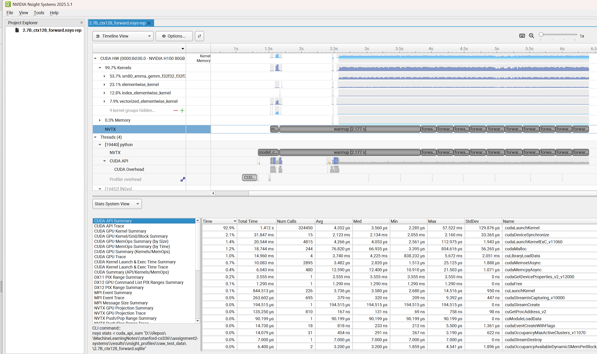
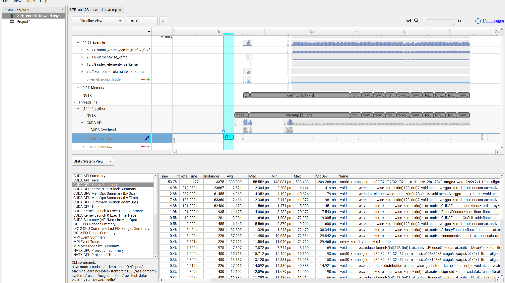
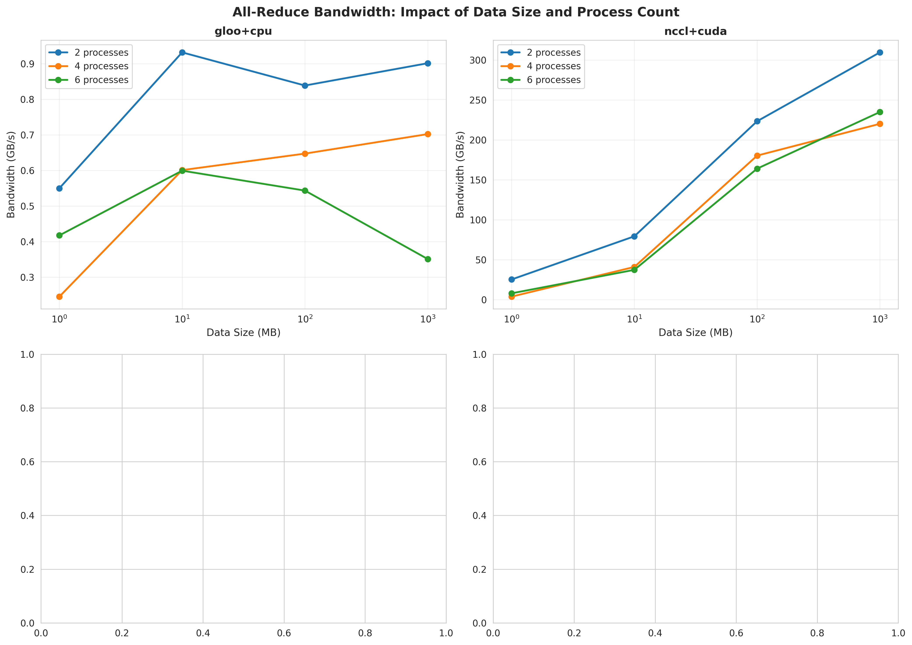
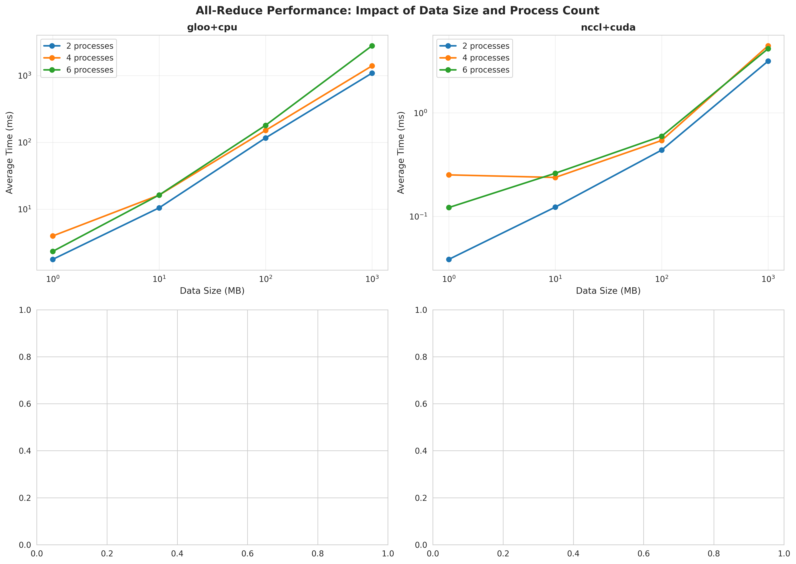
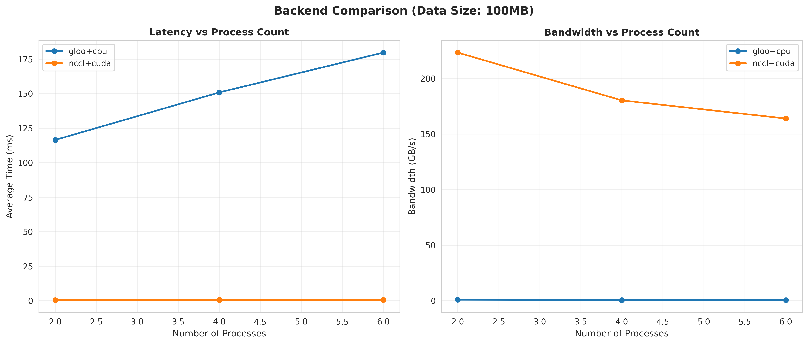

# LLM Systems Optimization: Memory, Speed, and Distributed Training

A deep-dive into the systems side of large language model training — benchmarking and optimizing attention, memory usage, mixed precision, torch.compile, and multi-GPU distributed training.

## What This Project Covers

| Section | Topic |
|---------|-------|
| Part 1 | Attention benchmarking — memory and latency vs sequence length |
| Part 2 | FlashAttention — IO-aware attention implementation and speedup |
| Part 3 | Memory profiling — activation and optimizer state analysis |
| Part 4 | Mixed precision training (BF16) |
| Part 5 | `torch.compile` benchmarking |
| Part 6 | Distributed communication — all-reduce backends |
| Part 7 | Distributed Data Parallel (DDP) — naive, flat, overlapped |
| Part 8 | Optimizer state sharding (ZeRO-style) |

---

## Part 1: Attention Benchmarking

Benchmarked standard PyTorch attention across `d_model ∈ {16, 32, 64, 128}` and `seq_len ∈ {256, 1024, 4096, 8192, 16384}` (batch size 8).

**Key result:** Memory grows quadratically with sequence length. `seq_len=16384` hits OOM on RTX 4090 for all `d_model` values. On H100, all configurations succeed.

**Forward pass latency (ms) — RTX 4090:**

| seq_len → | 256 | 1024 | 4096 | 8192 |
|-----------|-----|------|------|------|
| d_model=16 | 0.17 | 0.56 | 10.2 | 36.6 |
| d_model=128 | 0.56 | 0.60 | 13.9 | 45.5 |

**Peak memory (MB):**

| seq_len → | 256 | 1024 | 4096 | 8192 |
|-----------|-----|------|------|------|
| d_model=16 | 25 | 147 | 2,074 | 8,228 |
| d_model=128 | 29 | 164 | 2,144 | 8,368 |

Full results: `results/attention_benchmarking/` · H100 results: `results/attention_benchmarking/H100_results/`

---

## Part 2: FlashAttention

Implemented IO-aware FlashAttention (tiled SRAM kernel) and benchmarked against standard attention.

**Key result:** FlashAttention gives ~5x forward speedup at small sequence lengths; maintains this advantage at longer sequences. H100 results show FlashAttention handles `seq_len=16384` successfully where standard attention OOMs on smaller GPUs.

| Metric | Standard | FlashAttention | Speedup |
|--------|----------|----------------|---------|
| Forward (seq=128, d=16, bf16) | 0.031 ms | 0.006 ms | ~5× |
| Forward (seq=4096, d=128, fp32) | varies | varies | ~2–5× |

Full results: `results/flash_attention/`

---

## Part 3: Memory Profiling

Profiled a 2.7B-parameter model (batch size 4) across context lengths to measure activation and optimizer state memory.

**Peak memory — 2.7B model:**

| Context length | Forward pass | Full training step |
|---------------|--------------|-------------------|
| 128 | 13,288 MB | 65,577 MB |
| 256 | 13,457 MB | 65,408 MB |
| 512 | 14,011 MB | 69,460 MB |

Training step memory (~69 GB at ctx=512) is ~5× forward-only memory, driven by AdamW optimizer states (2× parameters in FP32) and gradients.

**Forward pass memory timeline** (2.7B, ctx=128) — flat profile, ~14 GB:


**Training step memory timeline** (2.7B, ctx=128) — sawtooth pattern: activations grow during forward, release during backward:


**Training step memory timeline** (2.7B, ctx=512, BF16) — same sawtooth, peaks ~65 GB:


Full results: `results/memory_profiling/`

---

## Part 3b: GPU Kernel Profiling (Nsight Systems)

Profiled the 2.7B forward pass with NVIDIA Nsight Systems to understand where GPU time is spent.

**Nsight Systems timeline** — CUDA kernel execution breakdown:





The profile shows the majority of time in `cudnn`/`cublas` matrix multiply kernels, with elementwise ops and attention taking a smaller share. Full profiles: `results/nsight_profiles/`

---

## Part 4: Mixed Precision (BF16)

Benchmarked FP32 vs BF16 training across model sizes (128M–2.7B parameters).

**Speed results (ctx=512, batch=4):**

| Model | FP32 total (ms) | BF16 total (ms) | Speedup |
|-------|----------------|-----------------|---------|
| small (128M) | 102 | 123 | 0.83× |
| medium (423M) | 267 | 290 | 0.92× |
| large (969M) | 557 | 540 | 1.03× |
| xl (2B) | 1,053 | 883 | 1.19× |
| 2.7B | 1,348 | 722 | **1.87×** |

BF16 speedup grows with model size — at 2.7B, nearly 2× faster. Smaller models don't benefit due to memory-bandwidth overhead.

**Memory at 2.7B (ctx=512):**

| Mode | FP32 | BF16 | Savings |
|------|------|------|---------|
| Forward | 14,011 MB | 19,973 MB | −43% (higher!) |
| Training | 69,460 MB | 66,525 MB | +4.2% |

Full results: `results/mixed_precision/` · `results/memory_profiling/`

---

## Part 5: `torch.compile`

Benchmarked `torch.compile` speedup across model sizes (128M–2.7B) and context lengths.

**Key result:** Small models (128M, ctx=128) get ~6× speedup. Large models (969M+) see <1% benefit — the overhead from large matrix operations dominates and compile overhead becomes negligible but so do gains.

| Model | ctx | Vanilla (ms) | Compiled (ms) | Speedup |
|-------|-----|-------------|---------------|---------|
| small (128M) | 128 | 107 ms | 21 ms | **5.0×** |
| small (128M) | 512 | 110 ms | 51 ms | **2.1×** |
| medium (423M) | 512 | 277 ms | 279 ms | 1.0× |
| 2.7B | 512 | 1,438 ms | 1,436 ms | 1.0× |

Full results: `results/torch_compile_benchmarking/`

---

## Part 6: Distributed Communication — All-Reduce

Benchmarked NCCL+CUDA vs gloo+CPU backends for all-reduce across 2/4/6 processes and data sizes from 1 MB to 1,000 MB.

**NCCL+CUDA is ~200× faster than gloo+CPU** at 100 MB:

| Backend | Avg time (100 MB) | Peak bandwidth |
|---------|------------------|----------------|
| gloo+cpu | 149 ms | ~0.9 GB/s |
| nccl+cuda | 0.5 ms | **~310 GB/s** |







Full results: `results/distributed_communication/`

---

## Part 7: Distributed Data Parallel (DDP)

Implemented and benchmarked three DDP variants on a 2B-parameter (XL) model across 2 GPUs:

| Implementation | Avg step time | Speedup vs naive |
|----------------|--------------|-----------------|
| Naive DDP | 808.66 ms | 1.00× |
| Flat DDP (single bucket) | 790.91 ms | 1.02× |
| Overlap individual | 799.28 ms | 1.01× |

Also benchmarked bucket sizes for bucketed DDP:

| Bucket size | Avg step time |
|-------------|--------------|
| 1 MB (435 buckets) | 1,004 ms |
| 100 MB (98 buckets) | 993 ms |
| 1,000 MB (8 buckets) | **980 ms** |

Larger buckets reduce all-reduce call overhead. Full results: `results/ddp_overlap_individual/` · `results/ddp_bucketed/`

---

## Part 8: Optimizer State Sharding (ZeRO-style)

Implemented ZeRO Stage 1-style optimizer state sharding across 2 GPUs on the XL model (2B params).

| Mode | Avg step time | Overhead |
|------|--------------|---------|
| Non-sharded | 783.53 ms | — |
| Sharded | 836.05 ms | +6.7% |

Sharding introduces ~6.7% overhead due to all-gather communication at each step, but enables larger models to fit in memory by distributing optimizer states.

Full results: `results/optimizer_sharding/`

---

## Repository Layout

```
assignment2-systems/
├── cs336_systems/              # Implementation
│   ├── attention/              # FlashAttention kernel
│   ├── distributed/            # DDP, all-reduce, optimizer sharding
│   └── benchmarks/             # Benchmarking scripts
├── cs336-basics/               # Base LM implementation (from Assignment 1)
├── results/
│   ├── attention_benchmarking/ # Part 1 — attention benchmark CSVs + H100 results
│   ├── flash_attention/        # Part 2 — FlashAttention benchmark CSVs
│   ├── memory_profiling/       # Part 3 — memory snapshots and summaries
│   ├── mixed_precision/        # Part 4 — BF16 benchmark CSV
│   ├── torch_compile_benchmarking/ # Part 5 — compile benchmark CSVs
│   ├── distributed_communication/  # Part 6 — all-reduce plots and analysis
│   ├── naive_ddp/              # Part 7 — naive DDP results
│   ├── flat_ddp/               # Part 7 — flat DDP results
│   ├── ddp_overlap_individual/ # Part 7 — overlapped DDP results
│   ├── ddp_bucketed/           # Part 7 — bucketed DDP results
│   └── optimizer_sharding/     # Part 8 — ZeRO sharding results
└── pyproject.toml
```

## Setup

```bash
uv sync
```
