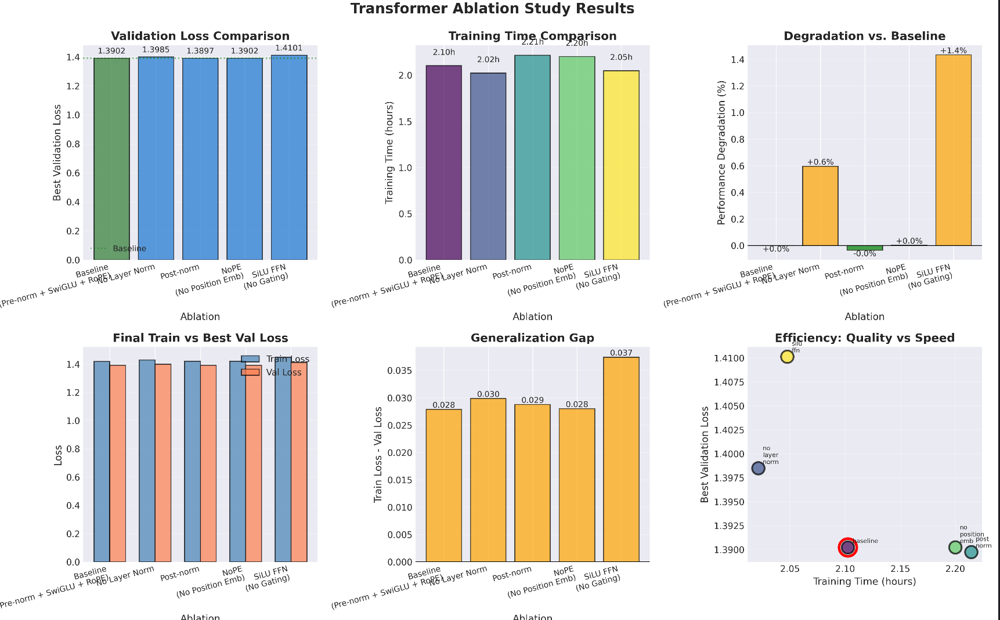
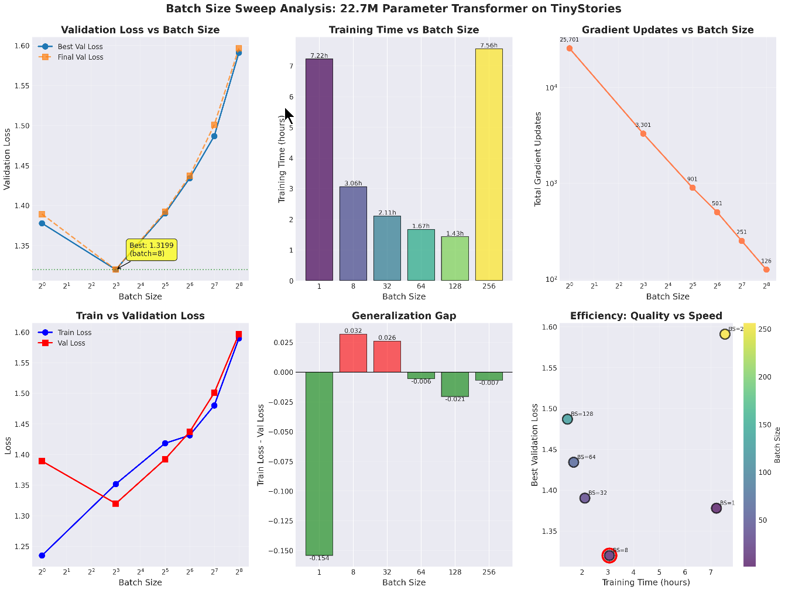
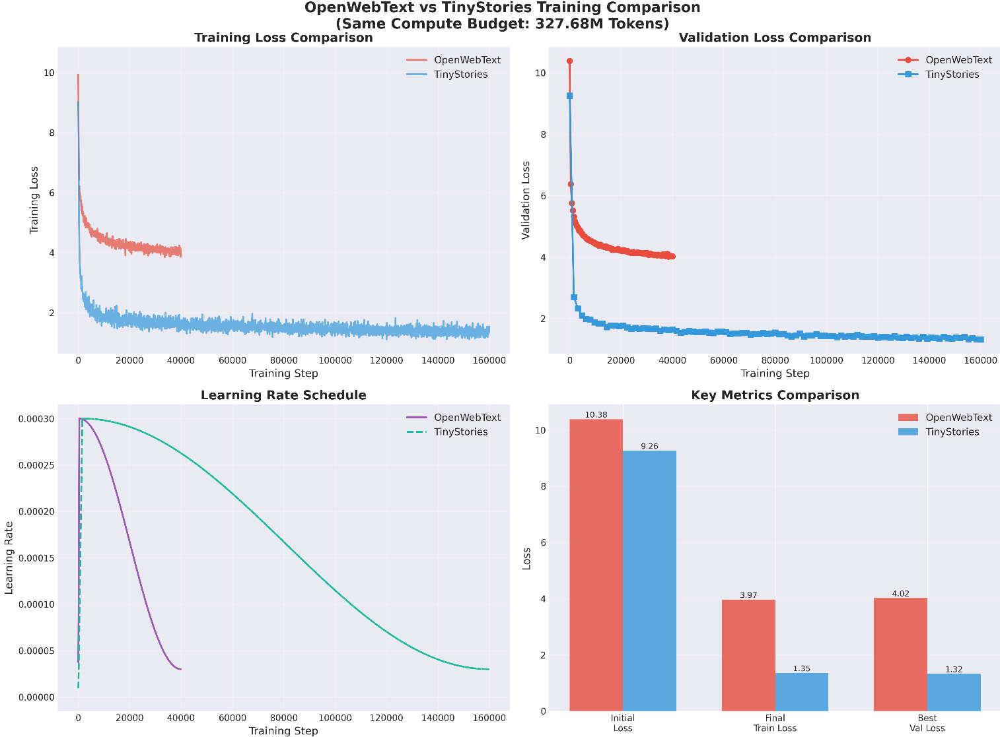

# Transformer Language Model: From BPE to Training

A from-scratch implementation of a GPT-2 style transformer, including a Byte Pair Encoding tokenizer, the full model architecture, and a training framework with systematic experiments exploring batch size, learning rate, and architecture choices.

## What This Project Covers

| Section | Topic |
|---------|-------|
| Part 1 | BPE tokenizer — from raw text to merge rules |
| Part 2 | Transformer architecture — RoPE, SwiGLU, RMSNorm pre-norm |
| Part 3 | Training infrastructure — AdamW, cosine LR, gradient clipping |
| Part 4 | Architecture ablations — norm placement, positional encoding, FFN activation |
| Part 5a | Batch size sweep |
| Part 5b | Learning rate sweep |
| Part 6 | OpenWebText training — scaling to a harder dataset |
| Part 7 | Leaderboard — 1.5-hour compute budget optimization |

---

## Architecture

The model follows a pre-norm GPT-2 style design with three modern upgrades:

| Component | Choice | Note |
|-----------|--------|------|
| Positional encoding | RoPE | Rotary position embedding |
| FFN activation | SwiGLU | Gated linear unit with SiLU |
| Normalization | RMSNorm (pre-norm) | Applied before each sub-layer |
| Optimizer | AdamW | With cosine LR decay + warmup |

---

## Part 4: Architecture Ablations

Trained five variants of a 22.7M-parameter model on TinyStories (327.68M tokens each) to isolate the contribution of each architectural choice.

| Variant | Change | Best Val Loss |
|---------|--------|---------------|
| Baseline | Pre-norm, RoPE, SwiGLU | **1.390** |
| no_layer_norm | Remove all RMSNorm layers | 1.398 |
| post_norm | Post-norm instead of pre-norm | 1.390 |
| no_position_emb | No positional encoding (NoPE) | 1.390 |
| silu_ffn | SiLU FFN instead of SwiGLU | 1.410 |

**Key findings:**
- Pre-norm vs post-norm makes almost no difference — both converge to the same loss
- Removing positional encoding barely hurts — attention can implicitly learn position
- SwiGLU outperforms plain SiLU by ~1.4% — the gating mechanism helps
- Removing all normalization causes unstable initialization (starting loss 17.7 vs 9.3) but recovers



Full per-run curves and configs: `cs336_basics/basics/runs/ablations/`

---

## Part 5a: Batch Size Sweep

Swept batch sizes from 1 to 512 at constant token budget (327.68M tokens), holding all other hyperparameters fixed.

| Batch size | Training time | Best val loss |
|------------|---------------|---------------|
| 1 | 7.22h | 1.378 |
| **8** | **3.06h** | **1.320** |
| 32 | 2.11h | 1.390 |
| 64 | 1.67h | 1.434 |
| 128 | 1.43h | 1.487 |
| 256 | 7.56h | 1.591 |
| 512 | OOM | — |

**Key finding:** Batch size 8 achieves the best validation loss (1.320) — at a constant token budget, smaller batches mean more gradient updates, which improves convergence. Batch size 512 OOMs on a 16 GB GPU.



---

## Part 5b: Learning Rate Sweep

Swept 7 learning rates from 1e-4 to 1e-2 at a constant token budget (327.68M tokens), holding all other hyperparameters fixed.

| Learning rate | Best val loss |
|--------------|---------------|
| 1e-4 | 1.745 |
| 3e-4 | 1.487 |
| 6e-4 | 1.395 |
| 1e-3 | 1.357 |
| **3e-3** | **1.317** |
| 6e-3 | 1.327 |
| 1e-2 | 1.403 |

**Key finding:** lr=3e-3 achieves the best validation loss (1.317). Performance degrades sharply below 3e-4 (underfitting) and above 6e-3 (instability). The sweet spot is a roughly 3× window around 3e-3.

Full per-run curves: `cs336_basics/basics/runs/lr_sweep/`

---

## Part 6: OpenWebText vs TinyStories

Trained the same architecture on OpenWebText (general web text) using identical compute (327.68M tokens).

| Dataset | Best val loss | Final train loss |
|---------|---------------|-----------------|
| TinyStories | 1.32 | 1.35 |
| OpenWebText | 4.02 | 3.97 |

The higher OWT loss reflects the dataset's difficulty — diverse, general-purpose web text is far harder to model than the narrow TinyStories distribution. Both runs converge cleanly with the same configuration.



---

## Part 7: Leaderboard — 1.5-Hour Budget

Optimized a 28.8M-parameter model for a fixed 1.5-hour compute budget on OpenWebText, starting from a 5.0 baseline loss.

**Optimizations applied:**
- **Weight tying** — shared input/output embeddings, 36% parameter reduction
- **Larger batch size** — 64 vs 32, more efficient GPU utilization
- **Scaled learning rate** — 4e-4 vs 3e-4
- **Mixed precision** — bfloat16

| Metric | Value |
|--------|-------|
| Final val loss | 4.678 |
| Baseline | 5.0 |
| Improvement | −0.322 |
| Perplexity | 107.6 |
| Tokens processed | 89.7M |
| Training time | 1.500h |


Config: `cs336_basics/basics/runs/leaderboard_final/config.json`

---

## Repository Layout

```
part1-basics/
├── cs336_basics/
│   ├── tokenizer/              # BPE tokenizer implementation
│   ├── tokenizer_training/     # Tokenizer training scripts
│   ├── transformer_training/   # Transformer architecture, training loop, optimizer
│   │   ├── model/              # Model definition
│   │   └── optimizer/          # AdamW implementation
│   ├── transformer_decode/     # Text generation / sampling
│   ├── basics/
│   │   ├── configs/            # Training config JSONs
│   │   └── runs/               # Experiment outputs
│   │       ├── ablations/      # 5 ablation variants + comparison plot
│   │       ├── batch_size_sweep/
│   │       ├── lr_sweep/
│   │       ├── openwebtext/
│   │       └── leaderboard_final/
│   ├── assignment_experiments/ # Experiment runner scripts
│   ├── experiments/            # Additional experiment scripts
│   └── artifacts/              # Vocabularies and tokenized datasets (gitignored)
├── pics/                       # Key result plots
├── tests/                      # Unit tests + adapters
└── pyproject.toml
```

## Setup

```bash
uv sync
```

### Download data

```bash
mkdir -p data && cd data

wget https://huggingface.co/datasets/roneneldan/TinyStories/resolve/main/TinyStoriesV2-GPT4-train.txt
wget https://huggingface.co/datasets/roneneldan/TinyStories/resolve/main/TinyStoriesV2-GPT4-valid.txt

wget https://huggingface.co/datasets/stanford-cs336/owt-sample/resolve/main/owt_train.txt.gz
gunzip owt_train.txt.gz
wget https://huggingface.co/datasets/stanford-cs336/owt-sample/resolve/main/owt_valid.txt.gz
gunzip owt_valid.txt.gz
```

### Run tests

```bash
uv run pytest
```

## References

- Vaswani et al., 2017 — [Attention Is All You Need](https://arxiv.org/abs/1706.03762)
- Radford et al., 2019 — [Language Models Are Unsupervised Multitask Learners (GPT-2)](https://cdn.openai.com/better-language-models/language_models_are_unsupervised_multitask_learners.pdf)
- Sennrich et al., 2016 — [Neural Machine Translation of Rare Words with Subword Units (BPE)](https://arxiv.org/abs/1508.07909)
- Zhang & Sennrich, 2019 — [Root Mean Square Layer Normalization](https://arxiv.org/abs/1910.07467)
- Ba et al., 2016 — [Layer Normalization](https://arxiv.org/abs/1607.06450)
- Kingma & Ba, 2015 — [Adam: A Method for Stochastic Optimization](https://arxiv.org/abs/1412.6980)
- Loshchilov & Hutter, 2019 — [Decoupled Weight Decay Regularization (AdamW)](https://arxiv.org/abs/1711.05101)
- Eldan & Li, 2023 — [TinyStories: How Small Can Language Models Be and Still Speak Coherent English?](https://arxiv.org/abs/2305.07759)
- Gokaslan et al., 2019 — [OpenWebText Corpus](http://Skylion007.github.io/OpenWebTextCorpus)
- Stanford CS336 Spring 2025 — [Language Models from Scratch, Part 1 (course framework)](https://github.com/stanford-cs336/assignment1-basics)
