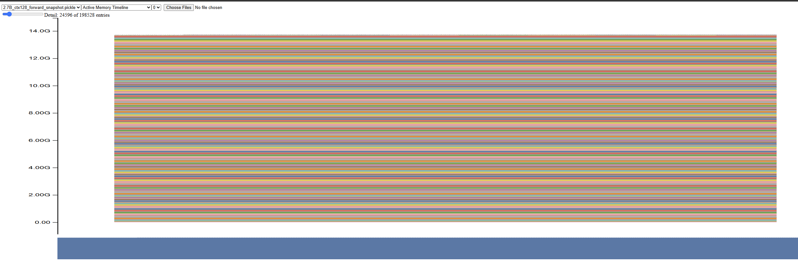
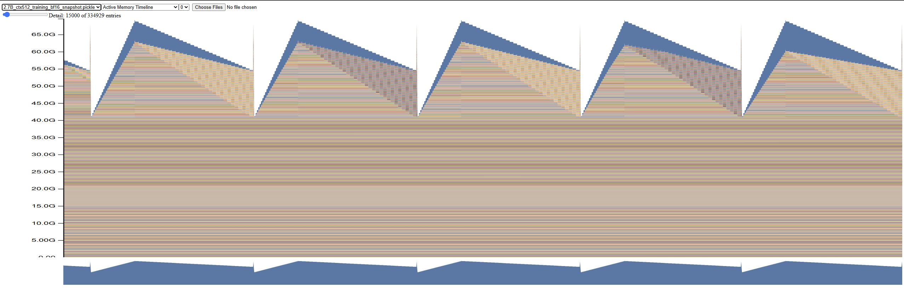
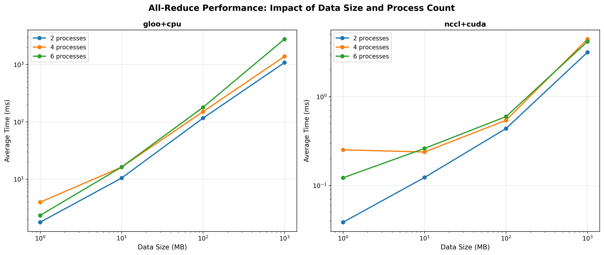

# LLM Systems Optimization: Memory, Speed, and Distributed Training

A deep-dive into the systems side of large language model training — benchmarking and optimizing attention, memory usage, mixed precision, torch.compile, and multi-GPU distributed training.

## What This Project Covers

| Section | Topic |
|---------|-------|
| Part 1 | Attention benchmarking — memory and latency vs sequence length |
| Part 2 | FlashAttention — PyTorch, Triton, and optimized Triton implementations |
| Part 3 | Memory profiling — activation and optimizer state analysis |
| Part 3b | GPU kernel profiling with Nsight Systems |
| Part 4 | Mixed precision training (BF16) |
| Part 5 | `torch.compile` benchmarking |
| Part 6 | Distributed communication — all-reduce backends |
| Part 7 | Distributed Data Parallel (DDP) — naive, flat, overlapped, bucketed |
| Part 8 | Optimizer state sharding (ZeRO-style) |
| Part 9 | 4D Parallelism — memory and communication accounting for 220B-parameter models |

---

## Part 1: Attention Benchmarking

Benchmarked standard PyTorch attention across `d_model ∈ {16, 32, 64, 128}` and `seq_len ∈ {256, 1024, 4096, 8192, 16384}` (batch size 8).

**Key result:** Memory grows quadratically with sequence length. `seq_len=16384` hits OOM on RTX 4090 for all `d_model` values. On H100, all configurations succeed.

**Forward pass latency (ms) — RTX 4090:**

| seq_len → | 256 | 1024 | 4096 | 8192 |
|-----------|-----|------|------|------|
| d_model=16 | 0.17 | 0.56 | 10.2 | 36.6 |
| d_model=128 | 0.56 | 0.60 | 13.9 | 45.5 |

**Peak memory (MB):**

| seq_len → | 256 | 1024 | 4096 | 8192 |
|-----------|-----|------|------|------|
| d_model=16 | 25 | 147 | 2,074 | 8,228 |
| d_model=128 | 29 | 164 | 2,144 | 8,368 |

Full results: `results/attention_benchmarking/` · H100 results: `results/attention_benchmarking/H100_results/`

---

## Part 2: FlashAttention

Implemented IO-aware FlashAttention in three progressively optimized variants:

1. **PyTorch reference** (`flash_attention_pytorch.py`) — tiled SRAM algorithm using standard PyTorch ops
2. **Triton kernel** (`flash_attention_triton.py`) — custom Triton GPU kernel for direct tile-level control; single-pass backward with `tl.atomic_add` for `dQ`
3. **Optimized Triton kernel** (`flash_attention_triton_optimized.py`) — autotuned tile sizes, causal early termination, and two-pass atomic-free backward

**Benchmark setup:** Single-head attention (`Q/K/V` shape `(1, seq_len, d_model)`), batch size 1, causal masking, both BF16 and FP32. Benchmarked with `triton.testing.do_bench` (25 warmup, 100 reps). Results below compare FlashAttention vs standard PyTorch attention; speedup >1× means FlashAttention is faster.

---

### Baseline Triton vs PyTorch

**Forward speedup — BF16:**

| seq_len | d_model=16 | d_model=32 | d_model=64 | d_model=128 |
|---------|-----------|-----------|-----------|------------|
| 1,024 | 2.7× | 2.1× | 2.2× | 1.2× |
| 4,096 | 4.5× | 3.2× | 3.4× | 1.6× |
| 8,192 | 7.5× | 5.4× | 5.6× | 2.7× |
| 16,384 | 10.4× | 8.1× | 8.2× | 4.5× |
| 65,536 | 12.7× | 10.9× | 9.6× | 4.4× |

**Backward speedup — BF16:**

| seq_len | d_model=16 | d_model=32 | d_model=64 | d_model=128 |
|---------|-----------|-----------|-----------|------------|
| 4,096 | 1.0× | 0.78× | 0.59× | 0.38× |
| 8,192 | 1.8× | 1.3× | 0.82× | 0.48× |
| 16,384 | 2.7× | 1.2× | 0.76× | 0.43× |
| 65,536 | 3.0× | 1.6× | 1.1× | 0.45× |

The baseline backward uses `tl.atomic_add` for `dQ` (grid is per key tile). Atomic contention grows with d_model, making the backward slower than PyTorch at d_model=64/128 for long sequences.

**End-to-end (fwd+bwd) speedup — BF16:**

| seq_len | d_model=16 | d_model=32 | d_model=64 | d_model=128 |
|---------|-----------|-----------|-----------|------------|
| 8,192 | 3.0× | 2.2× | 1.5× | 0.83× |
| 16,384 | 4.5× | 2.1× | 1.5× | 0.83× |
| 65,536 | 4.9× | 2.8× | 2.0× | 0.83× |

---

### Optimized Triton vs PyTorch

**Forward speedup — BF16:**

| seq_len | d_model=16 | d_model=32 | d_model=64 | d_model=128 |
|---------|-----------|-----------|-----------|------------|
| 1,024 | 2.7× | 2.1× | 2.3× | 1.2× |
| 4,096 | 5.1× | 3.7× | 3.9× | 1.9× |
| 8,192 | 8.8× | 6.3× | 6.7× | 3.2× |
| 16,384 | 12.5× | 9.7× | 9.8× | 5.4× |
| 65,536 | 15.8× | 13.7× | 12.1× | 5.6× |

**Backward speedup — BF16:**

| seq_len | d_model=16 | d_model=32 | d_model=64 | d_model=128 |
|---------|-----------|-----------|-----------|------------|
| 4,096 | 1.3× | 0.95× | 0.67× | 0.41× |
| 8,192 | 2.0× | 1.4× | 0.96× | 0.49× |
| 16,384 | 3.5× | 1.4× | 0.89× | 0.47× |
| 65,536 | 3.8× | 1.9× | 1.3× | 0.50× |

The two-pass backward (separate kernels for `dQ` and `dK/dV`) eliminates atomics and significantly improves backward at d_model=16/32. At d_model=64/128 the backward is still slower than PyTorch in BF16 — large tile matmuls in the backward face register pressure and memory bandwidth limits that atomics removal alone cannot overcome.

**End-to-end (fwd+bwd) speedup — BF16:**

| seq_len | d_model=16 | d_model=32 | d_model=64 | d_model=128 |
|---------|-----------|-----------|-----------|------------|
| 4,096 | 2.4× | 1.7× | 1.2× | 0.65× |
| 8,192 | 3.3× | 2.3× | 1.7× | 0.85× |
| 16,384 | 5.5× | 2.5× | 1.6× | 0.86× |
| 32,768 | 5.9× | 3.3× | 2.2× | 0.87× |
| 65,536 | 6.1× | 3.4× | 2.3× | 0.90× |

**Forward speedup — FP32:**

| seq_len | d_model=16 | d_model=32 | d_model=64 | d_model=128 |
|---------|-----------|-----------|-----------|------------|
| 128 | 4.8× | 4.5× | 2.5× | 1.2× |
| 1,024 | 2.1× | 1.5× | 0.64× | 0.39× |
| 4,096 | 4.3× | 2.9× | 1.3× | 0.81× |
| 8,192 | 7.8× | 5.2× | 2.3× | 1.5× |
| 16,384 | 16.2× | 11.5× | 5.0× | 1.7× |
| 32,768 | 18.2× | 10.6× | 4.8× | 1.5× |

**Backward speedup — FP32:**

| seq_len | d_model=16 | d_model=32 | d_model=64 | d_model=128 |
|---------|-----------|-----------|-----------|------------|
| 128 | 2.1× | 1.5× | 1.5× | 1.2× |
| 1,024 | 1.3× | 1.3× | 0.87× | 0.55× |
| 4,096 | 2.1× | 1.5× | 1.0× | 0.78× |
| 8,192 | 3.5× | 2.3× | 1.6× | 1.2× |
| 16,384 | 3.4× | 2.3× | 1.5× | 1.1× |
| 32,768 | 4.2× | 2.4× | 1.4× | 1.1× |

**End-to-end (fwd+bwd) speedup — FP32:**

| seq_len | d_model=16 | d_model=32 | d_model=64 | d_model=128 |
|---------|-----------|-----------|-----------|------------|
| 128 | 1.9× | 1.6× | 1.7× | 1.8× |
| 1,024 | 1.9× | 1.8× | 1.4× | 0.91× |
| 4,096 | 3.0× | 2.0× | 1.2× | 0.86× |
| 8,192 | 4.7× | 3.1× | 1.9× | 1.3× |
| 16,384 | 5.5× | 3.7× | 2.3× | 1.4× |
| 32,768 | 6.4× | 3.6× | 2.1× | 1.3× |

**Summary:** The optimized version is faster than PyTorch in the large majority of configurations. The exceptions are concentrated at medium seq lengths (512–4096) with large d_model (64/128), where the overhead of the tiled backward outweighs the forward savings — most visible in BF16 at d_model=128 for long sequences (fwd+bwd 0.87–0.90×). In FP32, d_model=128 recovers at short and long sequences (up to 1.8× fwd+bwd at seq=128, 1.3× at seq=32768), with the same medium-seq dip around seq=1024–4096. The peak speedup is 18.2× forward (FP32, d_model=16, seq=32768) and 6.4× end-to-end (FP32, d_model=16, seq=32768).

Full results: `results/flash_attention/flash_benchmarking.csv` (baseline) · `results/flash_attention/flash_benchmarking_optimized.csv` (optimized)

---

## Part 3: Memory Profiling

Profiled a 2.7B-parameter model (batch size 4) across context lengths to measure activation and optimizer state memory.

**Peak memory — 2.7B model:**

| Context length | Forward pass | Full training step |
|---------------|--------------|-------------------|
| 128 | 13,288 MB | 65,577 MB |
| 256 | 13,457 MB | 65,408 MB |
| 512 | 14,011 MB | 69,460 MB |

Training step memory (~69 GB at ctx=512) is ~5× forward-only memory, driven by AdamW optimizer states (2× parameters in FP32) and gradients.

**Forward pass memory timeline** (2.7B, ctx=128) — flat profile, ~14 GB:



**Training step memory timeline** (2.7B, ctx=128) — sawtooth pattern: activations grow during forward, release during backward:


**Training step memory timeline** (2.7B, ctx=512, BF16) — same sawtooth, peaks ~65 GB:



Full results: `results/memory_profiling/`

---

## Part 3b: GPU Kernel Profiling (Nsight Systems)

Profiled the 2.7B forward pass with NVIDIA Nsight Systems to understand where GPU time is spent.

**Nsight Systems timeline** — CUDA kernel execution breakdown:


The profile shows the majority of time in `cudnn`/`cublas` matrix multiply kernels, with elementwise ops and attention taking a smaller share. Full profiles: `results/nsight_profiles/`

---

## Part 4: Mixed Precision (BF16)

Benchmarked FP32 vs BF16 training across model sizes (128M–2.7B parameters).

**Speed results (ctx=512, batch=4):**

| Model | FP32 total (ms) | BF16 total (ms) | Speedup |
|-------|----------------|-----------------|---------|
| small (128M) | 102 | 123 | 0.83× |
| medium (423M) | 267 | 290 | 0.92× |
| large (969M) | 557 | 540 | 1.03× |
| xl (2B) | 1,053 | 883 | 1.19× |
| 2.7B | 1,348 | 722 | **1.87×** |

BF16 speedup grows with model size — at 2.7B, nearly 2× faster. Smaller models don't benefit due to memory-bandwidth overhead.

**Memory at 2.7B (ctx=512):**

| Mode | FP32 | BF16 | Savings |
|------|------|------|---------|
| Forward | 14,011 MB | 19,973 MB | −43% (higher!) |
| Training | 69,460 MB | 66,525 MB | +4.2% |

Full results: `results/mixed_precision/` · `results/memory_profiling/`

---

## Part 5: `torch.compile`

Benchmarked `torch.compile` speedup across model sizes (128M–2.7B) and context lengths.

**Key result:** Small models (128M, ctx=128) get ~5× speedup. Large models (969M+) see <1% benefit — the overhead from large matrix operations dominates and kernel launch savings become negligible.

| Model | ctx | Vanilla (ms) | Compiled (ms) | Speedup |
|-------|-----|-------------|---------------|---------|
| small (128M) | 128 | 107 ms | 21 ms | **5.0×** |
| small (128M) | 512 | 110 ms | 51 ms | **2.1×** |
| medium (423M) | 512 | 277 ms | 279 ms | 1.0× |
| 2.7B | 512 | 1,438 ms | 1,436 ms | 1.0× |

Full results: `results/torch_compile_benchmarking/` · H200 results: `results/torch_compile_benchmarking/H200_results/`

---

## Part 6: Distributed Communication — All-Reduce

Benchmarked NCCL+CUDA vs gloo+CPU backends for all-reduce across 2/4/6 processes and data sizes from 1 MB to 1,000 MB.

**NCCL+CUDA is ~300× faster than gloo+CPU** at 100 MB:

| Backend | Avg time (100 MB) | Peak bandwidth |
|---------|------------------|----------------|
| gloo+cpu | 149 ms | ~0.9 GB/s |
| nccl+cuda | 0.5 ms | **~310 GB/s** |





Full results: `results/distributed_communication/`

---

## Part 7: Distributed Data Parallel (DDP)

Implemented and benchmarked four DDP variants on a 2B-parameter (XL) model across 2 GPUs:

| Implementation | Avg step time | Speedup vs naive |
|----------------|--------------|-----------------|
| Naive DDP | 808.66 ms | 1.00× |
| Flat DDP (single bucket) | 790.91 ms | 1.02× |
| Overlap individual | 799.28 ms | 1.01× |

Also benchmarked bucket sizes for bucketed DDP:

| Bucket size | Avg step time |
|-------------|--------------|
| 1 MB (435 buckets) | 1,004 ms |
| 100 MB (98 buckets) | 993 ms |
| 1,000 MB (8 buckets) | **980 ms** |

Larger buckets reduce all-reduce call overhead. Full results: `results/naive_ddp/` · `results/flat_ddp/` · `results/ddp_overlap_individual/` · `results/ddp_bucketed/`

---

## Part 8: Optimizer State Sharding (ZeRO-style)

Implemented ZeRO Stage 1-style optimizer state sharding across 2 GPUs on the XL model (2B params).

| Mode | Avg step time | Overhead |
|------|--------------|---------|
| Non-sharded | 783.53 ms | — |
| Sharded | 836.05 ms | +6.7% |

Sharding introduces ~6.7% overhead due to all-gather communication at each step, but enables larger models to fit in memory by distributing optimizer states.

Full results: `results/optimizer_sharding/`

---

## Part 9: 4D Parallelism — Memory and Communication Accounting

Analyzed memory and communication requirements for training a 220B-parameter dense model using combinations of Data Parallelism (DP), Fully-Sharded Data Parallelism (FSDP), Tensor Parallelism (TP), and Pipeline Parallelism (PP).

**XXL model configuration:** d_model=16,384, d_ff=53,248, 126 layers — ~220B parameters.

**Single-device memory breakdown (FP32):**

| Component | Memory |
|-----------|--------|
| Master weights | 880 GB |
| Gradients | 880 GB |
| AdamW optimizer states | 1,760 GB |
| **Total** | **3,520 GB** |

At 80 GB per H100, this requires a minimum of 44 GPUs just to hold the model.

**FSDP sharding:** For typical training (batch=4, seq_len=2048), fitting under 95 GB per device requires ≥156 FSDP shards. With minimal activations, ≥38 devices suffice.

**Compute-bound batch size** on a 16 FSDP × 4 TP TPU v5p mesh: computation time (1,956 s) vastly exceeds communication time (1.38 s), confirming the setup is compute-bound at per-device batch size 1.

Full analysis: `cs336_systems/4d_parallelism/COMMUNICATION_ACCOUNTING.md`

---

## Repository Layout

```
part2-systems/
├── cs336_systems/              # Implementation
│   ├── attention_benchmarking/ # Part 1 — standard attention benchmark
│   ├── flash_attention/        # Part 2 — PyTorch, Triton, and optimized Triton implementations
│   ├── memory_profiling/       # Part 3 — memory snapshot and profiling scripts
│   ├── nsight_systems_profiler/# Part 3b — Nsight Systems profiling and analysis
│   ├── mixed_precision/        # Part 4 — BF16 benchmarking
│   ├── torch_compile_benchmarking/ # Part 5 — torch.compile benchmarking
│   ├── profiling_benchmarking/ # Shared forward/backward timing utilities
│   ├── distributed_communication/  # Part 6 — all-reduce backends
│   ├── naive_ddp/              # Part 7 — naive DDP implementation
│   ├── flat_ddp/               # Part 7 — flat (single-bucket) DDP
│   ├── ddp_overlap_individual/ # Part 7 — per-parameter comm/compute overlap
│   ├── ddp_bucketed/           # Part 7 — bucketed DDP
│   ├── optimizer_sharding/     # Part 8 — ZeRO Stage 1 optimizer sharding
│   └── 4d_parallelism/         # Part 9 — 4D parallelism accounting
├── cs336-basics/               # Base LM implementation (from Part 1)
├── results/
│   ├── attention_benchmarking/ # Part 1 — attention benchmark CSVs + H100 results
│   ├── flash_attention/        # Part 2 — FlashAttention benchmark CSVs
│   ├── memory_profiling/       # Part 3 — memory snapshots and summaries
│   ├── nsight_profiles/        # Part 3b — Nsight profiles and kernel summaries
│   ├── mixed_precision/        # Part 4 — BF16 benchmark CSV
│   ├── torch_compile_benchmarking/ # Part 5 — compile benchmark CSVs + H200 results
│   ├── distributed_communication/  # Part 6 — all-reduce plots and analysis
│   ├── naive_ddp/              # Part 7 — naive DDP results
│   ├── flat_ddp/               # Part 7 — flat DDP results
│   ├── ddp_overlap_individual/ # Part 7 — overlapped DDP results
│   ├── ddp_bucketed/           # Part 7 — bucketed DDP results
│   └── optimizer_sharding/     # Part 8 — ZeRO sharding results
└── pyproject.toml
```

## Environment

| | Local benchmarks | Remote benchmarks |
|---|---|---|
| GPU | RTX 4090 24 GB | H100 SXM4 80 GB · H200 80 GB |
| CUDA | 12.4 | 12.4 |
| Python | 3.11 | 3.11 |
| PyTorch | 2.6.0 | 2.6.0 |
| Triton | 3.0 | 3.0 |

*RTX 4090 results unless noted as H100 or H200.*

---

## Setup

```bash
uv sync
```

## References

- Dao et al., 2022 — [FlashAttention: Fast and Memory-Efficient Exact Attention with IO-Awareness](https://arxiv.org/abs/2205.14135)
- Dao, 2023 — [FlashAttention-2: Faster Attention with Better Parallelism and Work Partitioning](https://arxiv.org/abs/2307.08691)
- Milakov & Gimelshein, 2018 — [Online Normalizer Calculation for Softmax](https://arxiv.org/abs/1805.02867)
- Rajbhandari et al., 2020 — [ZeRO: Memory Optimizations Toward Training Trillion Parameter Models](https://arxiv.org/abs/1910.02054)
- Stanford CS336 Spring 2025 — [Language Models from Scratch, Part 2 (course framework)](https://github.com/stanford-cs336/assignment2-systems)
