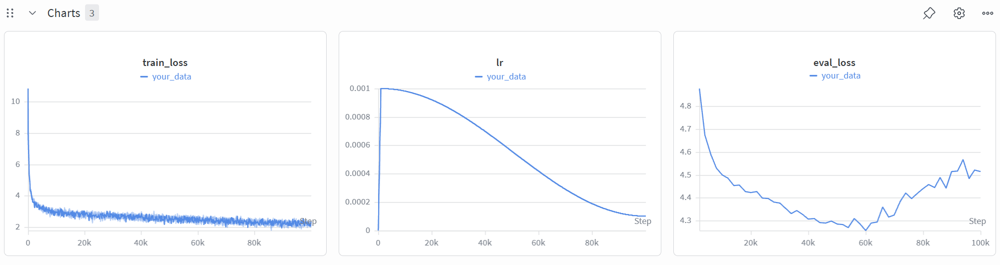
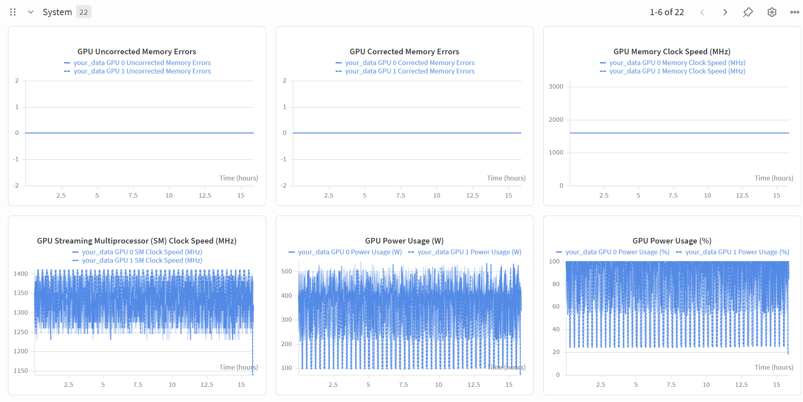

# LM Data Pipeline: Common Crawl → Trained Language Model

A full data engineering pipeline that turns raw Common Crawl web dumps into a trained GPT-2-scale language model, evaluated on the [Paloma](https://github.com/allenai/paloma) C4-100-domains benchmark.

## What This Project Does

Starting from hundreds of gigabytes of unfiltered web text, the pipeline:

1. **Extracts** clean text from raw HTML using Resiliparse
2. **Filters** for language, quality, safety, and PII
3. **Deduplicates** the corpus at both exact-line and fuzzy-document level
4. **Trains** an 85M-parameter Transformer on the resulting data

### Part 1: Overview

The core question: *how much does data quality matter?* Raw Common Crawl is ~7.9% usable text after filtering — the rest is non-English, low-quality, or harmful content. The goal is to maximize language model quality on the Paloma benchmark purely through better data, without changing the model or training procedure.

### Part 2: Filtering (`cs336_data/filtering_cc/`)

A multi-stage quality filter applied to CC WET files:

1. **HTML extraction** — strip markup, extract clean text with `resiliparse`
2. **Language identification** — `fastText` lid.176.bin model, keep English (score ≥ 0.65)
3. **PII masking** — regex-based masking of emails, phone numbers, IP addresses
4. **Harmful content** — Dolma NSFW / toxic-speech classifiers
5. **Gopher quality rules** — word count, mean word length, ellipsis ratio, alpha ratio
6. **Quality classifier** — fastText model trained on Wikipedia (positive) vs CC (negative) to score web-page quality

Written analysis for each stage is in `results/filtering_cc/`.

### Part 3: Deduplication (`cs336_data/deduplication/`)

- **Exact-line deduplication** — remove duplicate lines across the corpus using a global hash set
- **MinHash deduplication** — approximate fuzzy document deduplication via Locality-Sensitive Hashing (LSH)

### Part 4: Full Training Pipeline (`cs336_data/leaderboard/`)

End-to-end pipeline from raw CC to a trained language model evaluated on Paloma C4-100-domains.

#### Pipeline

| Step | Script | Output |
|------|--------|--------|
| Download CC WET files | `cs336_data/leaderboard/download_wet/part_4_download.sh` | `data/CC/*.warc.wet.gz` |
| Filter | `cs336_data/leaderboard/filter_data/part_4_filter.sh` | `data/filtered/*.txt` |
| Tokenize | `cs336_data/leaderboard/tokenize_data/part_4_tokenize.sh` | `data/tokenized/train.bin` |
| Train | `cs336_data/leaderboard/train_model/part_4_train.sh` | `cs336-basics/output/your_data/model.pt` |

#### Filter Results (600 WET files, CC-MAIN-2025-18)

| Stage | Removed | % of total |
|-------|---------|------------|
| Non-English | 10,603,105 | 64.8% |
| Low quality | 3,723,914 | 22.8% |
| Gopher fail | 481,112 | 2.9% |
| Too short | 262,401 | 1.6% |
| NSFW | 2,810 | 0.02% |
| **Kept** | **1,292,650** | **7.9%** |
| Total records | 16,365,992 | — |

#### Model Architecture

84.95M non-embedding parameters (GPT-2 scale):

| Hyperparameter | Value |
|----------------|-------|
| Vocabulary size | 50,257 (GPT-2 BPE) |
| Context length | 512 |
| d_model | 768 |
| Layers | 12 |
| Attention heads | 12 |
| d_ff | 2,048 |

#### Training Results

Trained for **100,000 steps** on 2× A100 GPUs (131,072 tokens/step, cosine LR decay from 1e-3).

| Metric | Value |
|--------|-------|
| Final train loss | ~2.5 |
| Best eval loss (Paloma) | ~4.3 (step ~60k) |
| Final eval loss (Paloma) | ~4.5 |

Training curves (wandb):





---

## Repository Layout

```
.
├── cs336-basics/               # GPT-2 training implementation
├── cs336_data/                 # Pipeline implementation
│   ├── assets/                 # Downloaded classifier models
│   ├── filtering_cc/           # Part 2 — filter implementations
│   ├── deduplication/          # Part 3 — deduplication implementations
│   └── leaderboard/            # Part 4 — full pipeline scripts
├── data/                       # Raw + processed data (gitignored)
│   ├── CC/                     # Downloaded WET files
│   ├── filtered/               # Post-filter documents + filter_stats.json
│   ├── tokenized/              # train.bin (GPT-2 tokenized)
│   └── paloma/                 # Paloma validation set
├── results/                    # Written analysis and evaluation outputs
│   ├── filtering_cc/           # Per-stage filter analysis
│   └── screenshots/            # Training curves (wandb)
├── setup_vm.sh                 # One-shot cloud VM setup script
├── get_assets.sh               # Download classifier model weights
└── pyproject.toml
```

## Setup

```bash
uv sync          # install dependencies
./get_assets.sh  # download lid.176.bin, Dolma models
```

For cloud VM deployment (vast.ai / Lambda / etc.):

```bash
bash setup_vm.sh
```

## Running Tests

```bash
uv run pytest -v
```

## References

- Rae et al., 2021 — [Scaling Language Models: Methods, Analysis & Insights from Training Gopher](https://arxiv.org/abs/2112.11446)
- Soldaini et al., 2024 — [Dolma: An Open Corpus of Three Trillion Tokens for Language Model Pretraining Research](https://arxiv.org/abs/2402.00159)
- Magnusson et al., 2023 — [Paloma: A Benchmark for Evaluating Language Model Fit](https://arxiv.org/abs/2312.10523)
- Raffel et al., 2020 — [Exploring the Limits of Transfer Learning with a Unified Text-to-Text Transformer (T5/C4)](https://arxiv.org/abs/1910.10683)
- Penedo et al., 2023 — [The RefinedWeb Dataset for Falcon LLM: Outperforming Curated Corpora with Web Data](https://arxiv.org/abs/2306.01116)
- Leskovec, Rajaraman & Ullman, 2014 — [Mining of Massive Datasets (MinHash/LSH)](http://www.mmds.org/)
- Stanford CS336 Spring 2025 — [Language Models from Scratch, Part 4 (course framework)](https://github.com/stanford-cs336/assignment4-data)