# Part 5 — Alignment and Reasoning RL

Teaching a 1.5B-parameter math model to reason step-by-step using supervised
fine-tuning, Expert Iteration, and Group Relative Policy Optimization (GRPO)
with verified rewards on the MATH competition dataset.

---

## Section 1 — Overview

This project explores a progression of techniques for improving mathematical reasoning in a small language model. Starting from a base model with no instruction-following or reasoning format knowledge, the pipeline applies increasingly powerful training methods to close the gap toward state-of-the-art reasoning performance.

**Model:** [Qwen 2.5 Math 1.5B Base](https://huggingface.co/Qwen/Qwen2.5-Math-1.5B) — a 1.5B-parameter model continually pretrained from Qwen 2.5 1.5B on high-quality synthetic math data. Small enough to iterate quickly; strong enough to show meaningful reasoning improvements.

**Dataset:** [MATH](https://arxiv.org/abs/2103.03874) — 12K competition-level math problems (algebra, geometry, number theory, etc.) with verified ground-truth answers. Evaluation uses string-match reward rather than cross-entropy, directly measuring whether the model produces correct answers.

**Pipeline:**

| Section | Method | Starting point | Key idea |
|---------|--------|---------------|----------|
| §3 | Zero-shot baseline | Base model | Measure format compliance and accuracy before any training |
| §4 | Supervised fine-tuning | `gpt-oss-120b` reasoning traces | Teach format and reasoning from teacher-generated data |
| §5 | Expert Iteration | Base model | Self-generate training data; keep correct rollouts; iterate |
| §7 | GRPO (implementation) | Base model | Policy gradient with group-normalized verified rewards |
| §8 | GRPO (experiments) | §7 implementation | Sweep LR, loss type, length norm, std norm, off-policy, prompt format |

---

## Section 2 — Background

### Chain-of-Thought Reasoning

Language models benefit significantly from generating explicit intermediate reasoning steps before producing a final answer — a technique known as chain-of-thought (CoT) prompting. Early work used a scratchpad to decompose arithmetic into steps; later work showed that prompting a model to "think step by step" substantially improves performance even without fine-tuning. This project uses the `r1_zero` prompt format which elicits `<think>...</think> <answer>...</answer>` structured outputs.

### Expert Iteration and STaR

The Self-Taught Reasoner (STaR) [Zelikman et al., 2022] frames reasoning improvement as a bootstrapping loop: sample chains-of-thought from the current model, keep those leading to correct answers, fine-tune on them, repeat. This is a form of Expert Iteration [Anthony et al., 2017] where the model generates its own curriculum — no human-written reasoning traces required. Correctness is verified automatically via string matching against ground-truth answers.

### Reasoning RL with Verified Rewards

Recent models (OpenAI o1/o3, DeepSeek R1, Kimi k1.5) apply policy gradient methods with verified rewards — using math correctness or unit test results as the reward signal rather than human preference. This approach has demonstrated remarkable gains on competition math and coding. Crucially, even models as small as 1.5B parameters show strong improvements from reasoning RL, confirming that the technique is not limited to frontier-scale models.

### Reward Function

All sections use the DrGRPO reward function from Liu et al. [2025]:
- **Format reward (0.5):** response contains both `<think>` and `<answer>` tags
- **Answer reward (0.5):** extracted answer matches ground truth (sympy-based equivalence)
- **Combined reward:** sum of the two; 1.0 = correct format and correct answer

---

## Section 3 — Zero-Shot Baseline

Evaluates Qwen 2.5 Math 1.5B zero-shot on 5K MATH validation examples using the
r1_zero prompt (`<think>...</think> <answer>...</answer>` format) and the DrGRPO
reward function. Serves as the baseline for all subsequent improvements.

**Key finding:** The base model defaults to `\boxed{}` format from math pretraining
rather than the r1_zero format, resulting in near-zero format compliance. This is
expected — RL training in later sections corrects it.

| Script | What it runs |
|--------|-------------|
| `part_5_3.sh` | vLLM batch inference on MATH validation set |

```bash
cd cs336_alignment/section3_zero_shot
./part_5_3.sh                        # full evaluation on cluster (5K examples)
./part_5_3.sh --max_examples 10      # smoke test (local, falls back to GSM8K)
```

**Output:** `results/section3/zero_shot_eval.jsonl` — one JSON record per example  
**Analysis:** `results/section3/zero_shot_analysis.md` — category breakdown and root cause

### Results

**Local smoke test (10 examples, GSM8K fallback):**

| Category | Count | % |
|---|---|---|
| Correct (format=1, answer=1) | 0 | 0% |
| Format ok, wrong answer (format=1, answer=0) | 1 | 10% |
| No format (format=0) | 9 | 90% |

**Full MATH validation (5,000 examples, RTX 4090):**

| Category | Count | % |
|---|---|---|
| Correct (format=1, answer=1) | 124 | 2.5% |
| Format ok, wrong answer (format=1, answer=0) | 707 | 14.1% |
| No format (format=0) | 4169 | 83.4% |

Conditional accuracy given format compliance: **14.9%** (124/831).

The base model defaults to `\boxed{}` from math pretraining — only 16.6% of responses
use the r1_zero format. Of those that do comply, the model answers correctly ~15% of
the time, suggesting latent reasoning ability that RL training will unlock.
See `results/section3/zero_shot_analysis.md` for the full breakdown.

---

## Section 4 — Supervised Fine-Tuning

Fine-tunes Qwen 2.5 Math 1.5B on reasoning traces generated by `gpt-oss-120b` on the MATH dataset. Implements core SFT primitives from scratch (tokenization, log-prob
computation, masked loss, gradient accumulation) then runs a training experiment
varying dataset size and data quality filtering.

### SFT Primitives (`helpers.py`)

| Function | Description |
|----------|-------------|
| `tokenize_prompt_and_output` | Tokenize prompt+response pairs; build response mask |
| `compute_entropy` | Per-token entropy of next-token predictions |
| `get_response_log_probs` | Per-token log-probs from a causal LM; optional entropy |
| `masked_normalize` | Masked sum with constant normalization |
| `sft_microbatch_train_step` | NLL loss, backward pass, gradient accumulation scaling |
| `log_generations` | vLLM rollout + reward + entropy diagnostics for in-loop logging |

### Training Experiment

Runs seven experiments sequentially (dataset size ablation + filtered data):

| Run | Training examples | Notes |
|-----|------------------|-------|
| `sft_n128` | 128 | |
| `sft_n256` | 256 | |
| `sft_n512` | 512 | |
| `sft_n1024` | 1024 | |
| `sft_full` | Full dataset (4836) | Target: ≥ 15% validation accuracy |
| `sft_filtered` | 4542, correct-only | Filtered by r1_zero_reward_fn (sympy equivalence) |
| `sft_filtered_repo` | 3496, correct-only | Filtered by strict string match |

```bash
cd cs336_alignment/section4_sft
./part_5_4.sh                        # helper tests + all 7 training runs (2 GPUs)
./part_5_4.sh --tests-only           # helper tests only (CPU, works locally)
./part_5_4.sh --train-only           # all 7 training runs, skip tests
./part_5_4.sh --ablation-only        # re-run only n128/256/512/1024, preserve full/filtered
./part_5_4.sh --smoke-test           # single-GPU local smoke test (32 examples, no eval)
./part_5_4.sh --filter-source auto   # filtered run: r1_zero_reward_fn only
./part_5_4.sh --filter-source repo   # filtered run: string-match file only
```

Training uses 2 GPUs: policy on `cuda:0`, vLLM evaluator on `cuda:1`. Evaluates
on MATH validation every 50 optimizer steps and logs accuracy curves to wandb.

Default hyperparameters: `lr=2e-5`, `micro_batch_size=2`, `gradient_accumulation_steps=32`
(effective batch size = 64). To tune:

```bash
uv run python cs336_alignment/section4_sft/train_sft.py \
    --lr 5e-5 --gradient_accumulation_steps 16 --run_name sft_full_lr5e5
```

**Generate plots after training:**

```bash
uv run python cs336_alignment/section4_sft/plot_sft_results.py
```

Reads all `eval_metrics_*.jsonl` files in `results/section4/` and saves:
- `results/section4/sft_ablation_accuracy.png` — accuracy vs step for each dataset size
- `results/section4/sft_filtered_comparison.png` — full vs filtered dataset comparison

**Output files:**
- `results/section4/dataset_info.json` — training set size per run
- `results/section4/eval_metrics_{run_name}.jsonl` — per-step accuracy/entropy/length (appended live)
- `results/section4/final_eval.json` — final validation accuracy
- `results/section4/sft_ablation_accuracy.png` — accuracy curves (after plotting)
- `results/section4/sft_filtered_comparison.png` — filter comparison (after plotting)
- `/data/$USER/sft_n{size}/` — model checkpoints (cluster)

### Results

All seven experiments ran on 2× A100 40 GB GPUs. Target was ≥ 15% validation accuracy on the full dataset — exceeded by a large margin.

**Final validation accuracy per run:**

| Run | Training examples | Peak accuracy | Final accuracy |
|-----|------------------|---------------|----------------|
| `sft_n128` | 128 | 51.0% | 51.0% |
| `sft_n256` | 256 | 58.5% | 57.5% |
| `sft_n512` | 512 | 63.5% | 63.5% |
| `sft_n1024` | 1024 | **65.0%** | 58.5% |
| `sft_full` | 4836 | 60.0% | 53.5% |
| `sft_filtered` | 4542 (correct-only, r1_zero_reward_fn) | **65.0%** | **65.0%** |
| `sft_filtered_repo` | 3496 (correct-only, string match) | 63.5% | 63.5% |

**Key findings:**
- Even 128 examples is enough to jump from 2.5% (zero-shot) to ~50% — SFT teaches format compliance immediately, which unlocks most of the gain
- Accuracy improves with dataset size up to 1024 examples (65% peak), then degrades slightly at end-of-training due to mild overfitting on the small set
- Correct-answer filtering makes a clear difference: `sft_filtered` reaches 65% and holds it through 200 steps, while `sft_full` peaks at 60% and degrades to 53.5% — the ~6% wrong-answer examples in the full dataset introduce noise that causes late overfitting
- Stricter string-match filtering (3496 examples) performs slightly below sympy-equivalence filtering (4542) — the extra 1046 examples that are mathematically correct but not string-identical do provide useful signal

**Accuracy curves (dataset size ablation):**

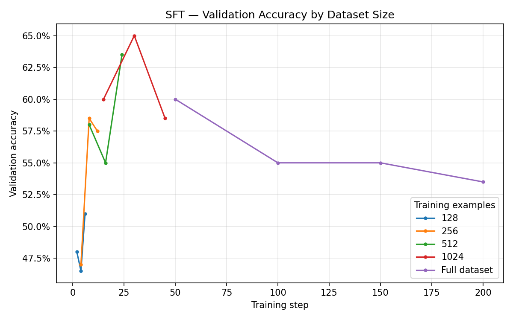

**Full dataset vs filtered comparison:**

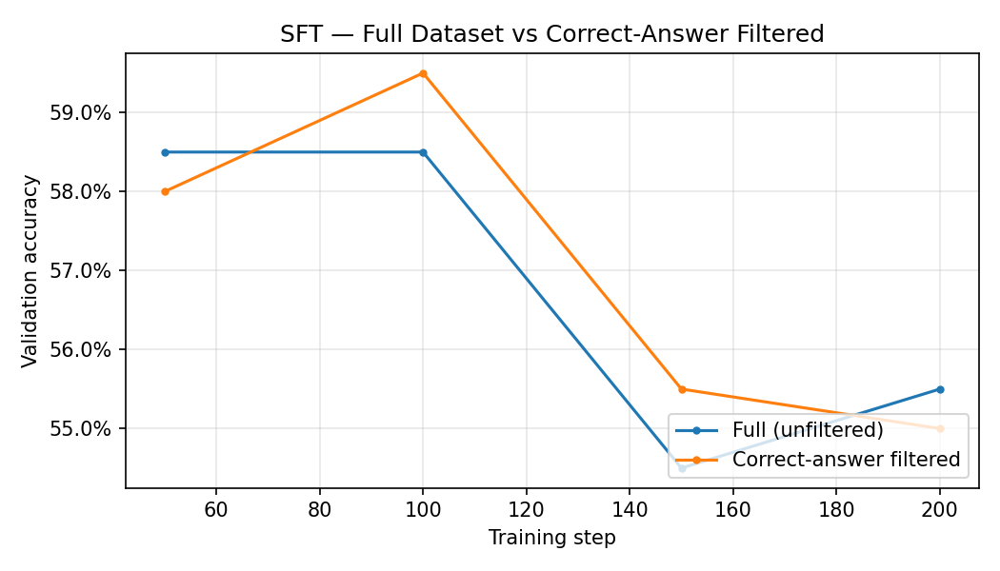

**Training loss and eval metrics (wandb):**

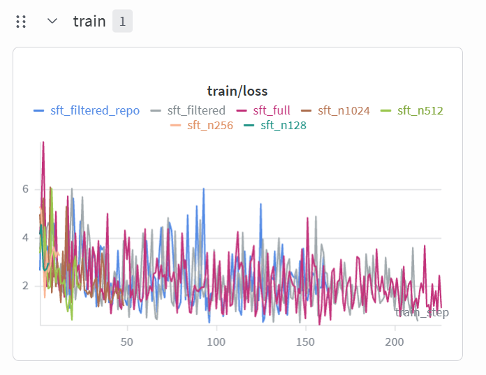

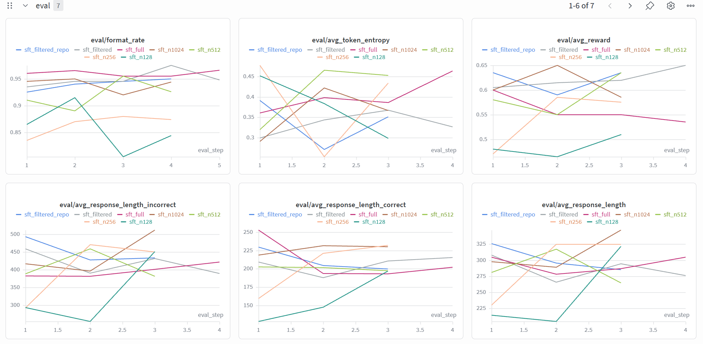

---

---

## Section 5 — Expert Iteration

Bootstraps mathematical reasoning from the base model (no teacher-generated data) using the Expert Iteration (STaR) algorithm: each step generates G rollouts per training question via vLLM, keeps those with reward > 0, fine-tunes the policy on the filtered set, then syncs the updated weights back to vLLM for the next step. Experiments vary G ∈ {1, 4} to measure the effect of rollout budget.

### Architecture

Two GPUs run in parallel with distinct roles:
- **cuda:0 (PyTorch)** — trainable policy: forward pass, backward pass, gradient accumulation, optimizer step
- **cuda:1 (vLLM)** — inference engine: batch rollout generation and validation evaluation

After each training phase, updated weights are copied `cuda:0 → CPU → cuda:1` (CPU intermediate avoids cross-GPU CUDA stream deadlock when vLLM holds its KV cache buffers). This sync runs twice per EI step — once before rollout, once before eval.

### Usage

```bash
cd cs336_alignment/section5_expert_iter
./part_5_5.sh                  # all 3 EI runs (G=1, 4, 16) on 2 GPUs
./part_5_5.sh --G 1            # single run with G=1
./part_5_5.sh --G 4            # single run with G=4
./part_5_5.sh --smoke-test     # single-GPU smoke test (32 questions, 1 step)
```

Default hyperparameters: `lr=2e-5`, `micro_batch_size=2`, `gradient_accumulation_steps=32`, `n_ei_steps=5`, `max_response_tokens=1024`.

**Generate plots after training:**

```bash
uv run python cs336_alignment/section5_expert_iter/plot_ei_results.py \
    --results results/section5
```

**Output files:**
- `results/section5/eval_metrics_{run_name}.jsonl` — per EI step metrics (accuracy, entropy, rollout size)
- `results/section5/ei_accuracy.png` — validation accuracy curves
- `results/section5/ei_entropy.png` — token entropy curves
- `results/section5/ei_rollout_size.png` — filtered rollout dataset size per step

### Results

Both experiments ran on 2× A100 SXM4 40 GB GPUs, starting from the base model with no teacher-generated data.

**Per-step validation accuracy:**

| EI Step | G=1 Accuracy | G=4 Accuracy | G=1 Rollouts | G=4 Rollouts |
|---------|-------------|-------------|-------------|-------------|
| 1 | 35.5% | 41.0% | 652 (8.7%) | 2,557 (8.5%) |
| 2 | 45.0% | 44.5% | 2,452 (32.7%) | 10,036 (33.5%) |
| 3 | 46.0% | 45.0% | 3,067 (40.9%) | 13,030 (43.4%) |
| 4 | **48.5%** | 46.5% | 3,291 (43.9%) | 14,299 (47.7%) |
| 5 | 47.5% | **52.5%** | 3,406 (45.4%) | 15,117 (50.4%) |

**Key findings:**
- Self-bootstrapping works: the fraction of training questions with at least one correct rollout grows from ~8.7% (step 1) to ~45–50% (step 5) for both G values — the model generates progressively better training data for itself
- G=4 final accuracy (52.5%) clearly exceeds G=1 (47.5%) and is still rising at step 5, while G=1 plateaued around step 3–4 — larger rollout budget provides richer training signal especially on harder questions
- Token entropy drops sharply after step 2–3 and stabilizes around 0.10–0.11 nats, indicating the model converges on a consistent reasoning format without collapsing
- Format rate converges to 90–95% by step 5, compared to ~84% at step 1 when the base model has no r1_zero format knowledge
- EI G=4 (52.5%) vs SFT full (53.5% final, 60.0% peak): near-competitive with SFT despite using no teacher data — the gap would likely close further with more EI steps or larger G

**Accuracy and entropy curves:**

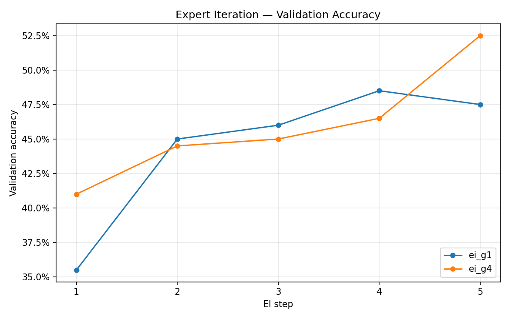

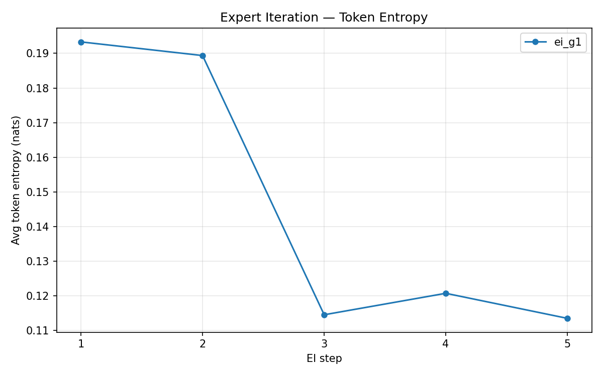

**Rollout dataset growth per step:**

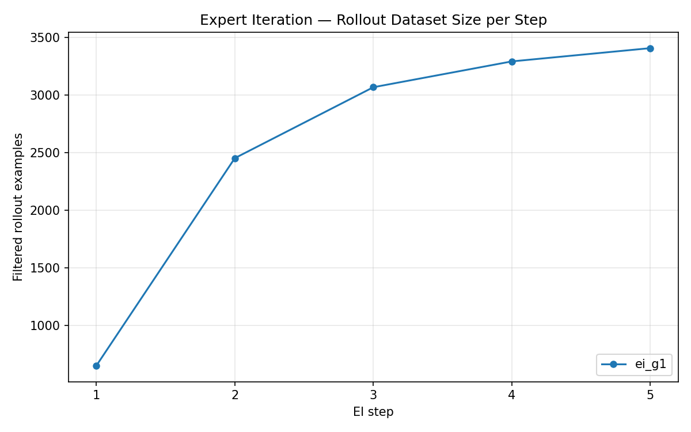

**Wandb eval metrics and training loss:**

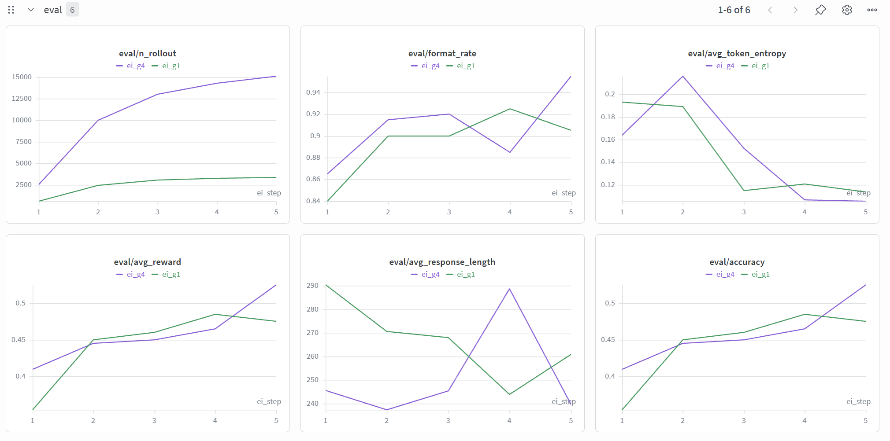

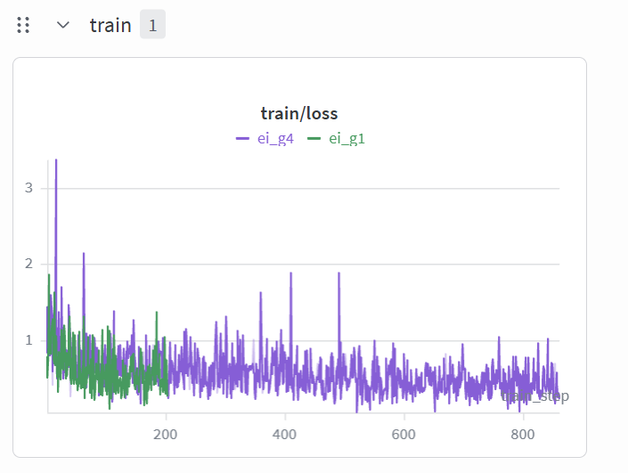

---

## Section 7 — GRPO Implementation

Implements the Group Relative Policy Optimization primitives used by all Section 8 experiments. GRPO eliminates the need for a separate critic/value network by normalizing advantages within a group of G rollouts sampled for the same question.

### GRPO Primitives (`helpers.py`)

| Function | Description |
|----------|-------------|
| `compute_group_normalized_rewards` | Normalize G rewards per question by group mean (and optionally std) |
| `compute_grpo_clip_loss` | PPO-style clipped surrogate loss (off-policy) |
| `compute_grpo_no_clip_loss` | Importance-weighted loss without clipping: `−(ratio × A)` |
| `compute_policy_gradient_loss` | Dispatcher for all four loss types |
| `grpo_microbatch_train_step` | Single microbatch step: log-prob computation, loss, backward pass |

Supports four loss types via `--loss_type`:

| Loss type | Description |
|-----------|-------------|
| `no_baseline` | REINFORCE without baseline — raw rewards as advantages |
| `reinforce_with_baseline` | Group mean subtracted; optionally divided by group std |
| `grpo_clip` | PPO-clipped importance-weighted loss (off-policy) |
| `grpo_no_clip` | Importance-weighted loss without clipping (off-policy ablation) |

Supports two length normalization strategies via `--length_norm`:

| Strategy | Description |
|----------|-------------|
| `masked_mean` | Average per-token loss over response tokens (default) |
| `masked_normalize` | Divide token loss sum by `max_response_tokens` (constant normalizer; longer responses get more gradient signal) |

### Training Loop (`train_grpo.py`)

Each GRPO step:
1. **Rollout** — sample G=8 responses per question via vLLM
2. **Reward** — score each response with `r1_zero_reward_fn` (format + answer correctness)
3. **Advantage** — group-normalize rewards within each question's G rollouts
4. **Train** — one (on-policy) or multiple (off-policy) epochs over the rollout batch with gradient accumulation
5. **Eval** — validate every 5 steps on 1024 held-out examples

Logs per-step to JSONL: step, accuracy, reward, token entropy, response length, grad norm, clip fraction, and wall-clock timestamp (for elapsed-time plots).

### Usage

```bash
cd cs336_alignment/section7_grpo

# Smoke test (3 steps, 64 examples — single GPU OK)
bash part_5_7.sh --smoke-test

# Dry-run: print the command without running
bash part_5_7.sh --dry-run --loss-type=grpo_clip --off-policy

# Full run (2× A100 required)
bash part_5_7.sh --lr=1e-5
bash part_5_7.sh --lr=1e-5 --loss-type=grpo_clip --off-policy
bash part_5_7.sh --lr=1e-5 --no-std            # Dr. GRPO variant
bash part_5_7.sh --lr=1e-5 --prompt-type=question_only
```

**Plotting (any subset of runs):**

```bash
uv run python cs336_alignment/section7_grpo/plot_grpo_results.py \
    --results_dir results/section8/lr_sweep \
    --output_dir  results/section8/lr_sweep \
    --x_axis grpo_step          # or eval_step, wall_clock_hours
```

**Output files:**
- `results/section8/<group>/eval_metrics_<run_name>.jsonl` — per-eval-step metrics (live append)
- `results/section8/<group>/grpo_accuracy.png` — accuracy comparison across runs in that group
- `results/section8/<group>/grpo_reward.png`, `grpo_entropy.png`, `grpo_grad_norm.png`, `grpo_response_length.png`, `grpo_clip_frac.png`

---

## Section 8 — GRPO Experiments

Six ablation groups exploring what makes GRPO training effective. All full runs use 200 GRPO steps, G=8 rollouts, 1024 validation examples, `max_response_tokens=1024`, on 2× A100 80 GB GPUs (~1.5 hrs per run).

Results are organized by experiment group under `results/section8/`.

---

### §8.1 — Learning Rate Sweep

Sweeps four log-spaced learning rates with `reinforce_with_baseline` (on-policy) to identify the best LR for all subsequent experiments.

```bash
bash cs336_alignment/section7_grpo/part_5_8_1.sh             # full sweep
bash cs336_alignment/section7_grpo/part_5_8_1.sh --smoke-test # 3 steps each, local
bash cs336_alignment/section7_grpo/part_5_8_1.sh --dry-run    # print commands only
```

**Results:**

| LR | Peak Accuracy | Peak Step | Final Accuracy | Grad Norm (final) |
|----|--------------|-----------|----------------|-------------------|
| 3e-6 | 32.0% | 195 | 30.0% | 1.1 |
| **1e-5** | **50.6%** | **145** | **47.3%** | **6.8** |
| 3e-5 | 41.6% | 5 | 31.5% | 8.3 |
| 1e-4 | 42.0% | 5 | 18.1% | 47.5 |

**Key findings:**
- `lr=1e-5` achieves the best final accuracy (47.3%) and highest peak (50.6%), well above the ≥25% target
- `lr=3e-6` is too conservative — still improving at step 195 but has not converged
- `lr=3e-5` peaks immediately (step 5) then degrades steadily; rising entropy (0.38) indicates the policy drifts toward uniform outputs
- `lr=1e-4` catastrophically collapses — grad norm of 47.5 signals training instability; accuracy falls to 18.1% by the end
- Higher LR → earlier peak → stronger policy collapse; the sweet spot is `lr=1e-5`

**Accuracy curves:**

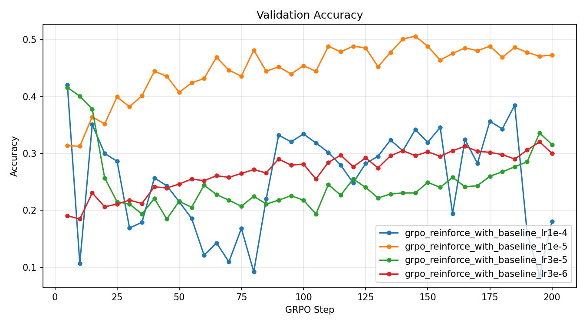

**Reward curves:**


**Entropy and gradient norm:**

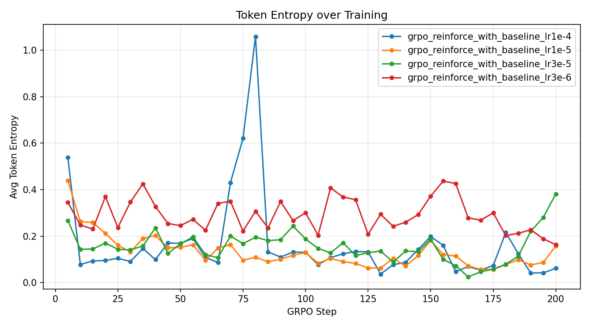

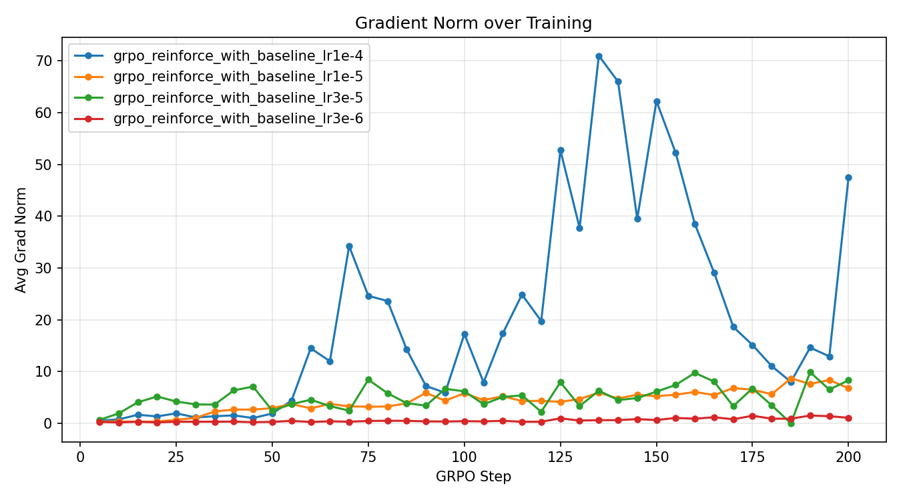

**Best LR for §8.2+:** `1e-5`

---

### §8.2–§8.6 — Planned Experiments

| Section | Experiment | Runs |
|---------|-----------|------|
| §8.2 | Loss type baselines | no_baseline, reinforce_with_baseline, grpo_clip (best LR) |
| §8.3 | Length normalization | masked_mean vs masked_normalize |
| §8.4 | Std normalization (Dr. GRPO) | with std vs without std |
| §8.5 | Off-policy training | grpo_clip epochs=4, epochs=2 bs=128 vs on-policy; clip vs no-clip |
| §8.6 | Prompt format | r1_zero vs question_only |

Results will be added here as experiments complete.

---

## Repository Layout

```
part5-alignment/
├── cs336_alignment/
│   ├── prompts/                    # r1_zero.prompt, question_only.prompt
│   ├── section3_zero_shot/
│   │   ├── evaluate_zero_shot.py   # vLLM batch evaluation script
│   │   └── part_5_3.sh
│   ├── section4_sft/
│   │   ├── helpers.py              # SFT primitives (tokenize, loss, entropy)
│   │   ├── train_sft.py            # Full SFT training loop
│   │   ├── plot_sft_results.py     # Accuracy curve plots from eval_metrics_*.jsonl
│   │   └── part_5_4.sh
│   ├── section5_expert_iter/       # Expert Iteration (STaR) — rollout-filter-finetune loop
│   │   ├── train_expert_iter.py    # EI training loop
│   │   ├── plot_ei_results.py      # Accuracy/entropy/rollout-size curves
│   │   └── part_5_5.sh
│   └── section7_grpo/              # GRPO with verified rewards
│       ├── helpers.py              # GRPO primitives (loss types, advantage, microbatch step)
│       ├── train_grpo.py           # Full GRPO training loop
│       ├── plot_grpo_results.py    # Metric curves from eval_metrics_*.jsonl
│       ├── part_5_7.sh             # Single GRPO run (all flags)
│       └── part_5_8_1.sh           # §8.1 LR sweep (4 runs + overlaid plots)
├── data/                           # Datasets (gitignored)
│   ├── math/                       # MATH competition dataset
│   └── gsm8k/                      # GSM8K (local smoke-test fallback)
├── assets/                         # Downloaded model checkpoints (gitignored)
├── results/
│   ├── section3/                   # zero_shot_eval.jsonl, zero_shot_analysis.md
│   ├── section4/                   # dataset_info.json, eval_metrics_*.jsonl, final_eval.json
│   ├── section5/                   # eval_metrics_*.jsonl, ei_accuracy.png, ei_entropy.png
│   ├── section7/
│   │   └── smoke/                  # Smoke-test JSONL and plots
│   └── section8/                   # Full experiment JSONL (flat) + plots by group
│       ├── eval_metrics_*.jsonl    # All run data (flat, uniquely named)
│       ├── lr_sweep/               # §8.1 comparison plots
│       ├── baselines/              # §8.2 comparison plots
│       ├── length_norm/            # §8.3 comparison plots
│       ├── std_norm/               # §8.4 comparison plots
│       ├── off_policy/             # §8.5 comparison plots
│       └── prompt_ablation/        # §8.6 comparison plots
├── tests/
│   ├── adapters.py                 # Connects implementations to test suite
│   ├── test_sft.py                 # Section 4 helper tests
│   └── test_grpo.py                # Section 7 GRPO helper tests (14 tests)
└── Requirements.md                 # Full technical spec for all sections
```

---

## Setup

```bash
uv sync --no-install-package flash-attn
uv sync
```

**First-time model download (local, ~3 GB):**

```bash
uv run huggingface-cli download Qwen/Qwen2.5-Math-1.5B \
    --local-dir assets/Qwen2.5-Math-1.5B
```

Shell scripts auto-detect and download the model if not found locally or on the cluster.

**WSL2 CUDA:** If `torch.cuda.is_available()` returns False, set Lenovo Vantage
graphics mode to **Hybrid** (not integrated-only).

---

## Running Tests

```bash
uv run pytest -v                     # all tests
uv run pytest tests/test_sft.py -v  # Section 4 helpers only
```

Run from the repo root (`part5-alignment/`) so snapshot paths resolve correctly.

---

## References

- DeepSeek-AI et al., 2025 — [DeepSeek-R1: Incentivizing Reasoning Capability in LLMs via Reinforcement Learning](https://arxiv.org/abs/2501.12948)
- Zelikman et al., 2022 — [STaR: Self-Taught Reasoner](https://arxiv.org/abs/2203.14465)
- Shao et al., 2024 — [DeepSeekMath: Pushing the Limits of Mathematical Reasoning in Open Language Models](https://arxiv.org/abs/2402.03300)
- Hendrycks et al., 2021 — [Measuring Mathematical Problem Solving With the MATH Dataset](https://arxiv.org/abs/2103.03874)
- Liu et al., 2025 — [Understanding R1-Zero-Like Training](https://github.com/sail-sg/understand-r1-zero)
- Kwon et al., 2023 — [Efficient Memory Management for Large Language Model Serving with PagedAttention (vLLM)](https://arxiv.org/abs/2309.06180)