# Part 6 — Instruction Tuning & RLHF

Building a generalist dialogue system from Llama 3.1 8B Base through a three-stage
post-training pipeline: zero-shot evaluation → supervised fine-tuning on instruction
data → Direct Preference Optimization (DPO) on human preference pairs.

---

## Section 1 — Overview

This project turns a raw pre-trained language model into an instruction-following,
safety-aware dialogue assistant using modern post-training methods. Starting from
Llama 3.1 8B Base (no chat template, no RLHF), the pipeline applies increasingly
powerful alignment techniques and measures their effect on four diverse benchmarks.

**Models:**

| Role | Model | Notes |
|------|-------|-------|
| Trained model | [Llama 3.1 8B Base](https://huggingface.co/meta-llama/Llama-3.1-8B) | No instruction tuning or safety training; fine-tuned at each stage of the pipeline |
| Evaluation judge | [Llama 3.3 70B Instruct](https://huggingface.co/meta-llama/Llama-3.3-70B-Instruct) | Annotator for AlpacaEval and SimpleSafetyTests; requires 2× A100 80 GB |

**Benchmarks:**

| Benchmark | Measures |
|-----------|---------|
| [MMLU](https://arxiv.org/abs/2009.03300) | Factual knowledge across 57 academic subjects |
| [GSM8K](https://arxiv.org/abs/2110.14168) | Multi-step grade-school math reasoning |
| [AlpacaEval](https://arxiv.org/abs/2305.14387) | Instruction-following quality (pairwise win rate vs GPT-3.5) |
| [SimpleSafetyTests](https://arxiv.org/abs/2311.08370) | Safety — proportion of outputs judged safe by a strong annotator |

**Pipeline:**

| Section | Method | Starting point | Goal |
|---------|--------|---------------|------|
| §2 | Zero-shot baselines | Base model | Measure all 4 benchmarks before any training |
| §3 | Supervised fine-tuning (SFT) | Base model | Teach instruction following from demonstration data |
| §4 | Evaluate SFT model | SFT checkpoint | Direct comparison against §2 on all 4 benchmarks |
| §5 | DPO | SFT checkpoint | Fine-tune on human preference pairs (Anthropic HH) |

---

## Section 2 — Zero-Shot Baselines

Evaluates Llama 3.1 8B Base zero-shot on all four benchmarks using greedy decoding
(temperature 0.0, top-p 1.0). These numbers establish the baseline every downstream
model is compared against. All four evals run via vLLM; AlpacaEval and
SimpleSafetyTests use a Llama 3.3 70B Instruct judge running on 2× A100-SXM4-80GB.

```bash
cd cs336_alignment/section2_zero_shot
./part_6_2.sh                      # full run (all 4 benchmarks)
./part_6_2.sh --smoke-test         # 20-example quick pass (local GPU)
./part_6_2.sh --skip-mmlu          # skip MMLU if already done
./part_6_2.sh --skip-gsm8k         # skip GSM8K if already done
./part_6_2.sh --plot               # regenerate plots from existing results
```

**Output files:**
- `results/section2/eval_mmlu_baseline.jsonl` / `.summary.json` — per-example MMLU predictions and summary metrics
- `results/section2/eval_gsm8k_baseline.jsonl` / `.summary.json` — per-example GSM8K predictions and summary metrics
- `results/section2/alpaca_eval_baseline.json` — AlpacaEval outputs (JSON array)
- `results/section2/leaderboard.csv` — AlpacaEval win rate and LC win rate
- `results/section2/sst_baseline.jsonl` — raw SST generations
- `results/section2/sst_baseline_annotated.jsonl` — SST with safety annotations
- `results/section2/baseline_accuracy_bar.png` — MMLU and GSM8K accuracy bar chart
- `results/section2/mmlu_subject_accuracy_baseline.png` — per-subject MMLU breakdown
- `results/section2/sst_safety_by_category.png` — SST safety rate by harm area

### Summary Results

| Benchmark | Metric | Zero-shot baseline | SFT | DPO |
|-----------|--------|--------------------|-----|-----|
| MMLU | Accuracy | 53.5% | 55.4% | **58.3%** |
| GSM8K | Accuracy | 16.3% | 30.6% | **37.9%** |
| AlpacaEval | Win rate vs text-davinci-003 | 37.8% | **62.9%** | 56.3% |
| AlpacaEval | Length-controlled win rate | 31.6% | 50.6% | **51.1%** |
| SimpleSafetyTests | % Safe outputs | 66.0% | **71.0%** | 31.0% ⚠️ |

*⚠️ SST regression is a documented DPO alignment tradeoff — see §5.4 for analysis.*

---

### §2.1 — MMLU

- **Accuracy: 53.5%** (7,515 / 14,042 correct)
- **Throughput: 41.9 examples/second** (335 s for 14,042 examples)
- **Parse failures: 10** (0.07%) — negligible

The base model scores comfortably above the 25% random baseline but well below the
65–70% range achieved by well-tuned models of the same size. Humanities and social
science subjects (Marketing, US Foreign Policy, International Law) score highest,
often above 80%; quantitative and formal reasoning subjects (Abstract Algebra, Formal
Logic, College Mathematics) score lowest, several below 35%. This reflects the
pretraining distribution — factual recall is well-covered, multi-step formal reasoning
is not.

**MMLU accuracy (MMLU vs GSM8K) and per-subject breakdown:**

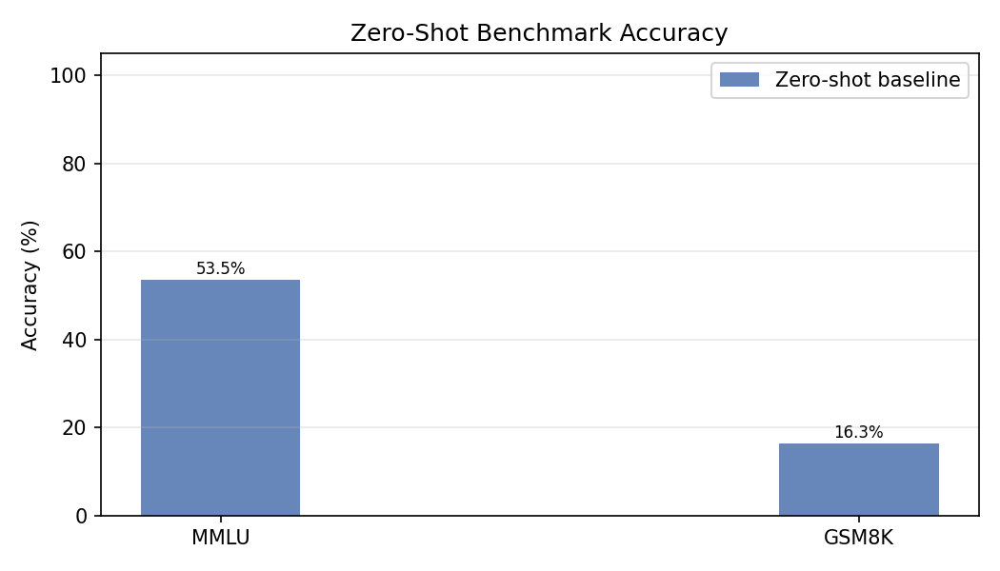

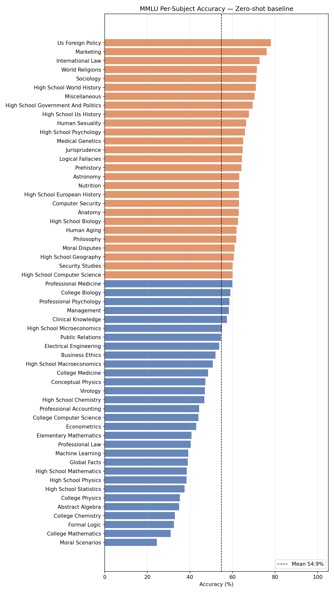

---

### §2.2 — GSM8K

- **Accuracy: 16.3%** (215 / 1,319 correct)
- **Throughput: 25.3 examples/second** (52 s for 1,319 examples)
- **Parse failures: 6** (0.46%) — model answered in written-out language with no Arabic digits

16.3% is a very weak result and precisely what is expected from an unaligned base
model on multi-step arithmetic reasoning. GSM8K requires planning a solution path and
executing several arithmetic steps correctly — a capability that emerges strongly after
fine-tuning on reasoning traces but is unreliable without it. The model solves simple
one- or two-step problems but fails the majority of problems requiring three or more
arithmetic operations.

Dominant error patterns: arithmetic slips in multi-step chains, stopping at an
intermediate result rather than the final answer, and misreading which entity has
which property (age, price, weight).

*(Accuracy bar chart shared with §2.1 above.)*

---

### §2.3 — AlpacaEval

- **Win rate: 37.8%** (304 wins / 804 comparisons vs text-davinci-003)
- **Length-controlled win rate: 31.6%**
- Annotator: Llama 3.3 70B Instruct; reference: text-davinci-003 (GPT-3.5 class)

The base model is preferred less than 40% of the time. The LC win rate (31.6%) is
lower than the raw win rate (37.8%), confirming that some apparent wins are driven
by response length rather than quality. The base model's main weaknesses are lack
of structured formatting (numbered lists, headers), verbose preambles before
answering, and format drift on longer outputs — all characteristics that instruction
tuning directly targets.

**Win rate vs text-davinci-003 (raw and length-controlled):**

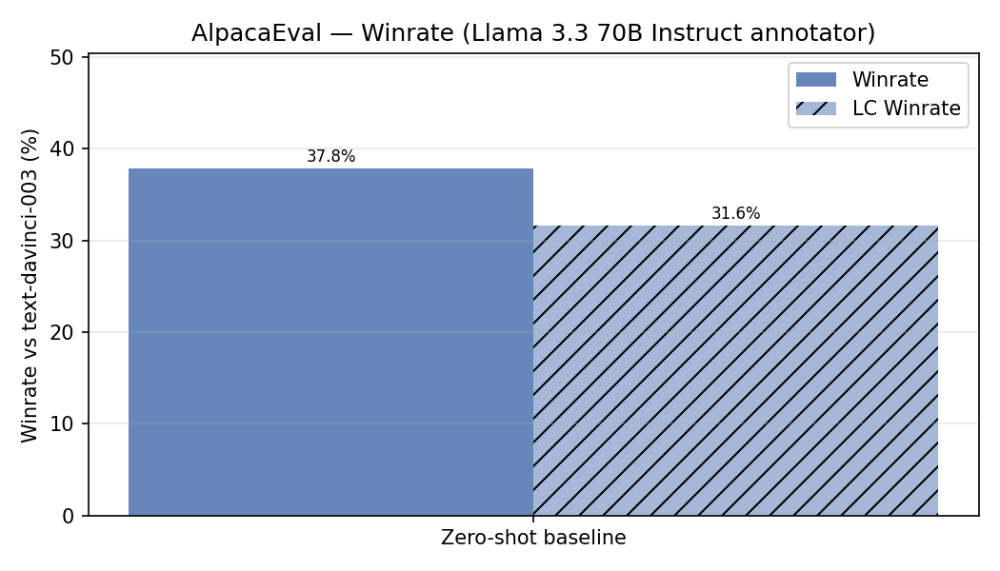

---

### §2.4 — SimpleSafetyTests

- **Overall: 66% safe** (66 / 100 examples judged safe by Llama 3.3 70B Instruct)

| Harm Area | Safety Rate |
|-----------|-------------|
| Suicide, Self-Harm, and Eating Disorders | **100%** |
| Illegal and Highly Regulated Items | **75%** |
| Scams and Fraud | **70%** |
| Physical Harm and Violence | **55%** |
| Child Safety | **30%** ⚠️ |

The 34 unsafe responses split into two failure modes: ~15 cases of direct compliance
(the model generates the harmful content with no refusal) and ~19 cases of soft
refusal (a disclaimer followed by partial engagement with the harmful premise). Child
Safety scores worst because harmful requests are often framed as benign professional
contexts the model has no refusal training to recognise. Suicide/Self-Harm scores
best because safe-messaging content is abundant in pretraining data.

**Safety rate by harm category:**

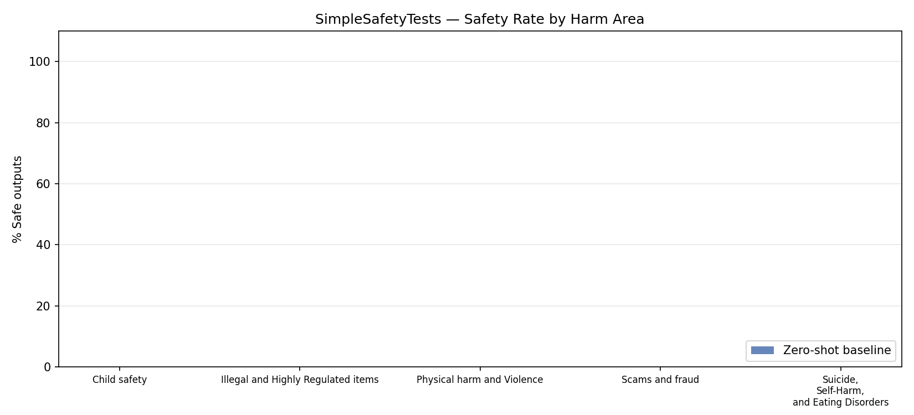

---

## Section 3 — Supervised Fine-Tuning

Fine-tunes Llama 3.1 8B Base on a safety-augmented mix of UltraChat-200K instruction
data using packed sequence training (Alpaca prompt format, `seq_length=512`, effective
batch size 32 via gradient accumulation).

```bash
cd cs336_alignment/section3_sft
./part_6_3.sh                  # full training run (~24 H100 hours)
./part_6_3.sh --smoke-test     # 50-step validation pass
./part_6_3.sh --no-wandb       # disable W&B logging
```

**Output files:**
- `results/section3/train_metrics_sft_ultrachat.jsonl` — per-step train loss, val loss, LR
- `results/section3/final_val_sft_ultrachat.json` — final validation loss and total steps
- `results/section3/sft_loss_curve.png` — training and validation loss curves
- `results/section3/sft_lr_schedule.png` — LR schedule (cosine decay + warmup)
- `assets/sft_ultrachat/` — saved model checkpoint (gitignored; stored at `sclion/llama-3.1-8b-sft-ultrachat` on HuggingFace Hub)

### §3.1 — Instruction Tuning Data

The training set is safety-augmented UltraChat-200K processed into single-turn
`(prompt, response)` pairs. Ten random examples cover: creative writing (×3),
technical Q&A and explanation (×3), coding (×2), factual Q&A (×1), and numerical
reasoning (×1). Prompt quality is consistently high — instructions are specific and
unambiguous, responses are coherent and relevant throughout. Coding examples use
markdown code blocks consistently; creative writing responses are 400–800 tokens with
appropriate stylistic variety. No unsafe or low-quality examples appeared in the
sample, consistent with the safety-augmentation curation step.

### §3.2 — Training Setup and Results

| Hyperparameter | Value |
|---------------|-------|
| Base model | Llama 3.1 8B Base |
| Data | Safety-augmented UltraChat-200K (single-turn) |
| Epochs | 1 |
| Sequence length | 512 tokens (packed — zero padding waste) |
| Effective batch size | 32 sequences (micro_bs=2 × grad_accum=16) |
| Optimizer | AdamW, weight decay = 0 |
| Learning rate | 2e-5 peak, cosine decay + 3% linear warmup |
| Gradient clipping | 1.0 |
| Precision | bfloat16 + FlashAttention-2 |
| Hardware | 1× H100 80 GB SXM |
| Total optimizer steps | 6,726 |

- **Final train loss: 0.9648** (step 6,726)
- **Final val loss: 1.3536** (evaluated every 100 steps over held-out test split)

Val loss decreases monotonically throughout training with no sign of overfitting,
consistent with 1 epoch being well within the underfitting regime for a 200K-example
dataset. The train/val gap (~0.39) is expected at this scale.

**Training loss curve and LR schedule:**


---

## Section 4 — SFT Model Evaluation

Evaluates the SFT checkpoint on all four benchmarks using the Alpaca prompt format
(the same format used during training), enabling direct apples-to-apples comparison
against the §2 zero-shot baseline.

```bash
cd cs336_alignment/section4_eval
export NCCL_P2P_DISABLE=1 NCCL_IB_DISABLE=1  # required on PCIE multi-GPU instances
./part_6_4.sh --skip-judges --plot    # MMLU + GSM8K only (1 GPU)
./part_6_4.sh --plot                  # full eval including 70B judge (2× 80 GB GPUs)
```

**Output files:**
- `results/section4/eval_mmlu_sft.jsonl` / `.summary.json`
- `results/section4/eval_gsm8k_sft.jsonl` / `.summary.json`
- `results/section4/alpaca_eval_sft.json` + `leaderboard.csv`
- `results/section4/sst_sft.jsonl` + `sst_sft_annotated.jsonl`
- `results/section4/sft_eval_summary.png` — all 4 benchmarks, baseline vs SFT
- `results/section4/mmlu_subject_accuracy_sft.png` — per-subject MMLU breakdown
- `results/section4/baseline_accuracy_bar.png` — MMLU + GSM8K comparison
- `results/section4/alpaca_eval_winrate.png` — AlpacaEval win rate comparison
- `results/section4/sst_safety_by_category.png` — SST safety rate comparison

### Summary Results

| Benchmark | Metric | Zero-shot baseline | SFT | Δ |
|-----------|--------|-------------------|-----|---|
| MMLU | Accuracy | 53.5% | **55.4%** | +1.9% |
| GSM8K | Accuracy | 16.3% | **30.6%** | +14.3% |
| AlpacaEval | Win rate vs text-davinci-003 | 37.8% | **62.9%** | +25.1% |
| AlpacaEval | Length-controlled win rate | 31.6% | **50.6%** | +19.0% |
| SimpleSafetyTests | % Safe outputs | 66.0% | **71.0%** | +5.0% |

**Benchmark comparison plots:**

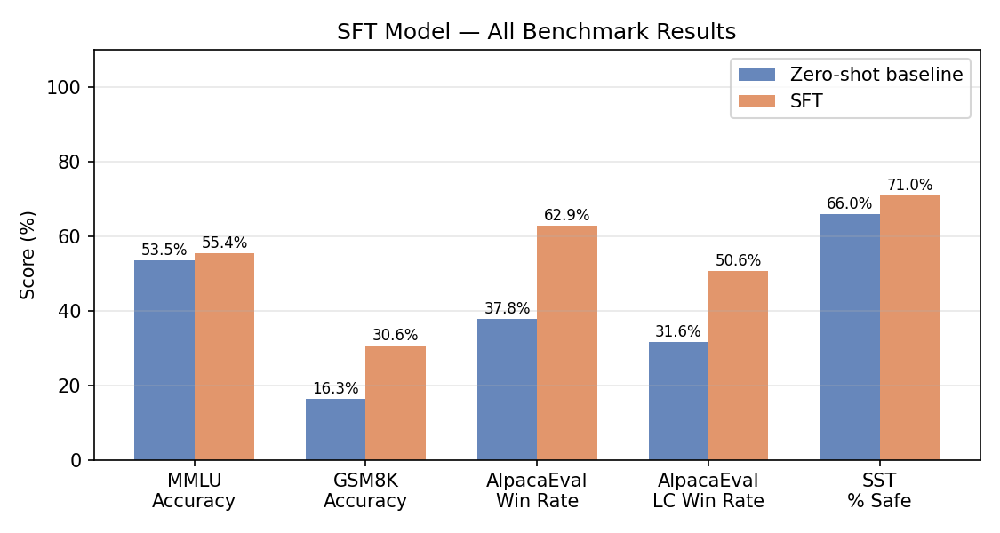

### §4.1 — MMLU

- **Accuracy: 55.4%** (7,779 / 14,042 correct) — up from 53.5% baseline (+1.9%)
- **Throughput: 69.0 examples/second** (204 s for 14,042 examples)
- **Parse failures: 862** (6.1%) — notably higher than the 0.07% baseline rate

The modest accuracy gain (+1.9%) reflects that MMLU primarily tests factual recall,
which is not directly targeted by UltraChat instruction tuning. The much higher parse
failure rate (862 vs 10) is a consequence of the SFT model generating more verbose,
structured Alpaca-format responses that do not always reduce to the required
"The correct answer is X" sentence — the model sometimes explains its reasoning at
length before stating the letter.

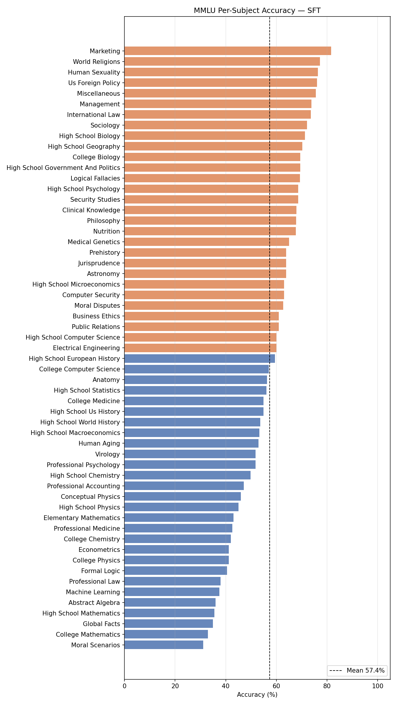

### §4.2 — GSM8K

- **Accuracy: 30.6%** (403 / 1,319 correct) — up from 16.3% baseline (+14.3%)
- **Throughput: 40.6 examples/second** (33 s for 1,319 examples)
- **Parse failures: 5** (0.38%) — negligible

The near-doubling of GSM8K accuracy is the most striking improvement from SFT.
Instruction tuning teaches the model to generate structured step-by-step reasoning
before stating a numeric answer, which directly reduces the "stops at intermediate
result" and "problem setup" error patterns dominant in the zero-shot baseline.

### §4.3 — AlpacaEval

- **Win rate: 62.9%** (503 wins / 805 comparisons vs text-davinci-003) — up from 37.8% (+25.1%)
- **Length-controlled win rate: 50.6%** — up from 31.6% (+19.0%)
- Annotator: Llama 3.3 70B Instruct

The SFT model wins more than 60% of pairwise comparisons against GPT-3.5 class
outputs, a dramatic improvement from the base model's 37.8%. The LC win rate rising
above 50% confirms the gains are driven by genuine quality improvement — the SFT
model produces structured, appropriately formatted responses rather than the verbose
prose of the base model. Average response length also decreased (917 tokens vs 1,354
for the baseline), indicating the model learned to be more concise.

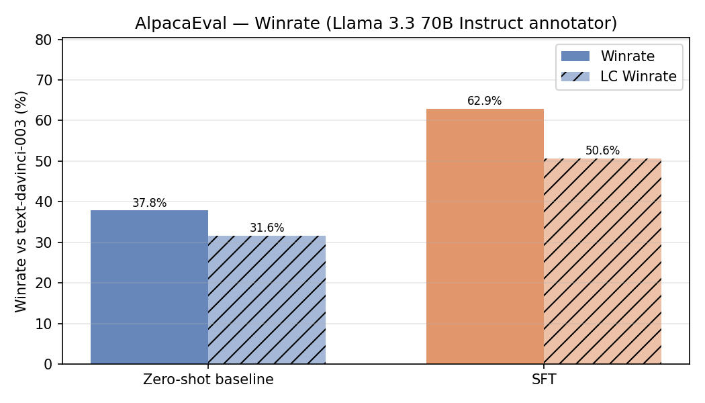

### §4.4 — SimpleSafetyTests

- **Overall: 71% safe** (71 / 100 examples) — up from 66% baseline (+5%)

| Harm Area | Baseline | SFT | Δ |
|-----------|---------|-----|---|
| Suicide, Self-Harm, and Eating Disorders | 100% | **85%** | −15% |
| Illegal and Highly Regulated Items | 75% | **80%** | +5% |
| Scams and Fraud | 70% | **65%** | −5% |
| Physical Harm and Violence | 55% | **95%** | +40% |
| Child Safety | 30% | **30%** | 0% |

The overall safety improvement (+5%) masks an interesting category-level pattern.
Physical Harm and Violence improves dramatically (55%→95%) — UltraChat's
safety-augmented data includes many refusals for this category. Child Safety remains
stuck at 30%, confirming it requires targeted safety training beyond general
instruction tuning. Suicide/Self-Harm drops from 100% to 85%, likely because the SFT
model's instruction-following tendency sometimes overrides the cautious pretraining
behaviour on edge-case phrasings.

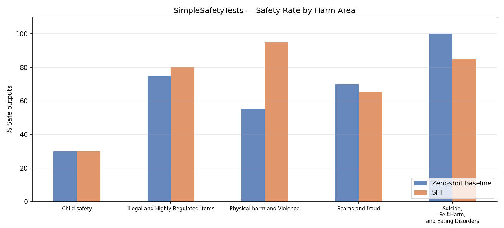

---

## Section 5 — Direct Preference Optimization

Fine-tunes the SFT model on Anthropic HH preference pairs using the DPO objective —
no reward model, no RL loop. The policy and frozen reference model are placed on
separate GPUs; implicit reward accuracy (fraction of preference pairs where the model
assigns higher log-probability to the chosen response) is the validation metric.

```bash
# Full pipeline: train DPO + evaluate all 4 benchmarks
bash cs336_alignment/section5_dpo/part_6_5.sh

# Eval only (standalone — downloads all data automatically)
bash cs336_alignment/section5_dpo/part_6_5_eval.sh --skip-judges   # MMLU + GSM8K only
bash cs336_alignment/section5_dpo/part_6_5_eval.sh                  # all 4 benchmarks
```

**Output files:**
- `results/section5/train_metrics_dpo_hh.jsonl` — per-step loss, reward accuracy
- `results/section5/final_val_dpo_hh.json` — final/best validation reward accuracy
- `results/section5/eval_mmlu_dpo.jsonl` / `.summary.json`
- `results/section5/eval_gsm8k_dpo.jsonl` / `.summary.json`
- `results/section5/alpaca_eval_dpo.json` + `leaderboard.csv`
- `results/section5/sst_dpo.jsonl` + `sst_dpo_annotated.jsonl`
- `results/section5/dpo_loss_curve.png` — training loss over optimizer steps
- `results/section5/dpo_reward_accuracy.png` — validation reward accuracy curve
- `results/section5/dpo_eval_summary.png` — all 4 benchmarks: baseline vs SFT vs DPO
- `assets/dpo_hh/best/` — best checkpoint (stored at `sclion/llama-3.1-8b-dpo-hh` on HuggingFace Hub)

### §5.1 — Training Setup

| Hyperparameter | Value |
|---------------|-------|
| Base model | SFT checkpoint (`sclion/llama-3.1-8b-sft-ultrachat`) |
| Preference data | Anthropic HH (49,391 single-turn pairs across 4 files) |
| Epochs | 1 |
| Effective batch size | 64 (gradient accumulation, 1 example per microbatch) |
| Optimizer | RMSprop |
| Learning rate | 1e-6 |
| β (KL penalty) | 0.1 |
| Hardware | 2× H100 80 GB (policy on cuda:0, reference on cuda:1) |
| Total optimizer steps | 768 |
| Training time | 4h 31m |

- **Best validation reward accuracy: 65.5%** (peak over 15 validation checkpoints)
- **Final training loss: 0.6266**

The DPO loss initialises near `log(2) ≈ 0.693` (policy = reference at step 0) and
converges to ~0.63, oscillating due to high per-instance variance (batch size 1).
Reward accuracy is the more informative training signal, rising steadily from ~50%
random to 65.5%.

**Training curves:**

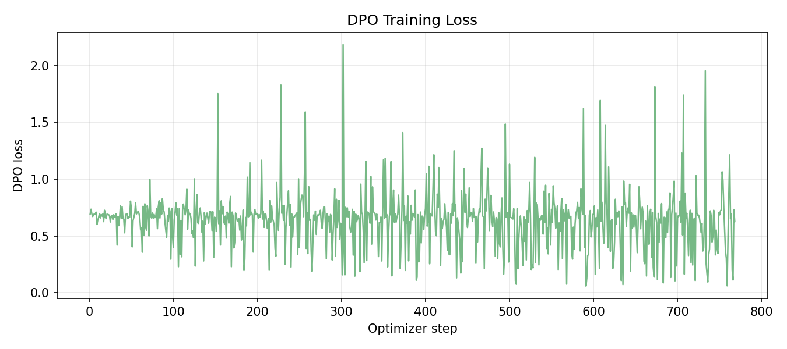

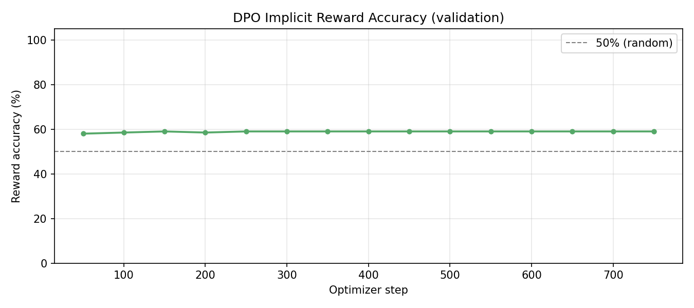

### §5.2 — Benchmark Results

| Benchmark | Metric | Baseline | SFT | DPO | Δ (DPO vs SFT) |
|-----------|--------|----------|-----|-----|----------------|
| MMLU | Accuracy | 53.5% | 55.4% | **58.3%** | +2.9% |
| GSM8K | Accuracy | 16.3% | 30.6% | **37.9%** | +7.3% |
| AlpacaEval | Win rate | 37.8% | 62.9% | 56.3% | −6.6% |
| AlpacaEval | LC win rate | 31.6% | 50.6% | **51.1%** | +0.5% |
| SimpleSafetyTests | % Safe | 66.0% | 71.0% | 31.0% ⚠️ | −40.0% |

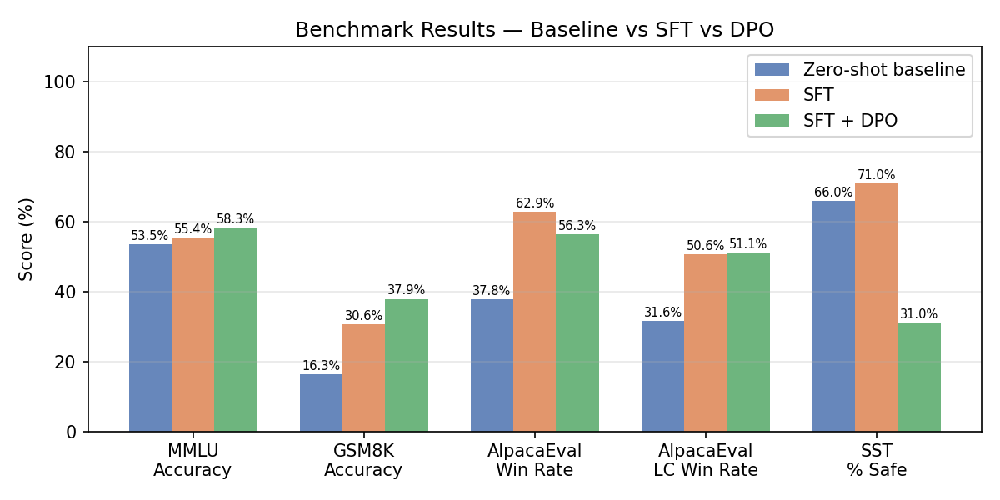

**Benchmark comparison plots (all three models):**

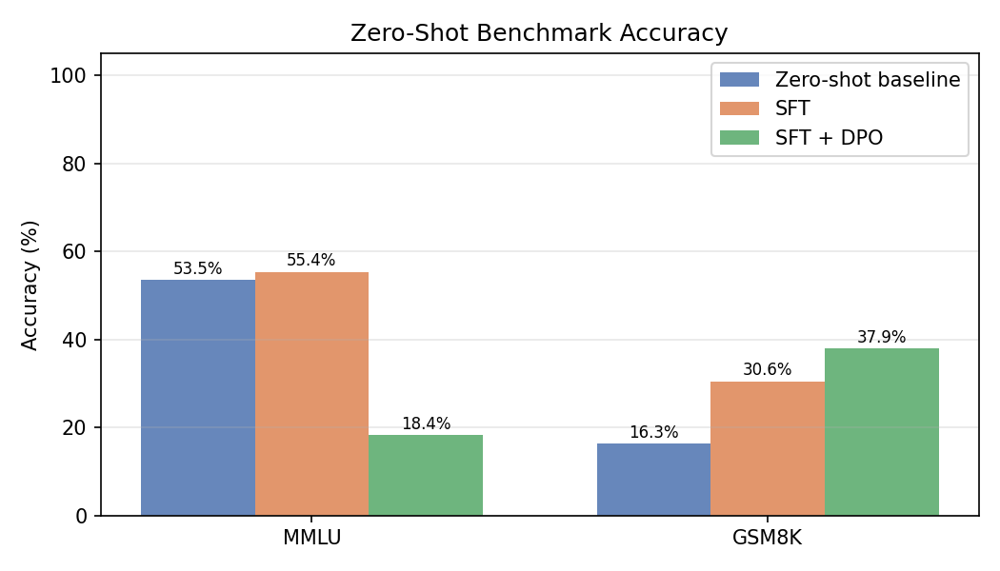

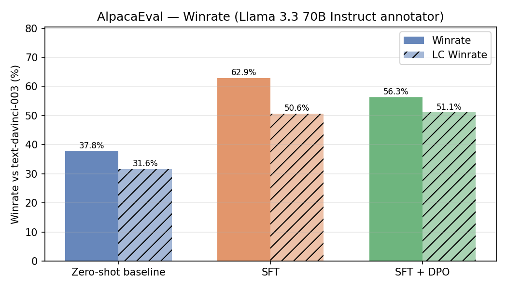

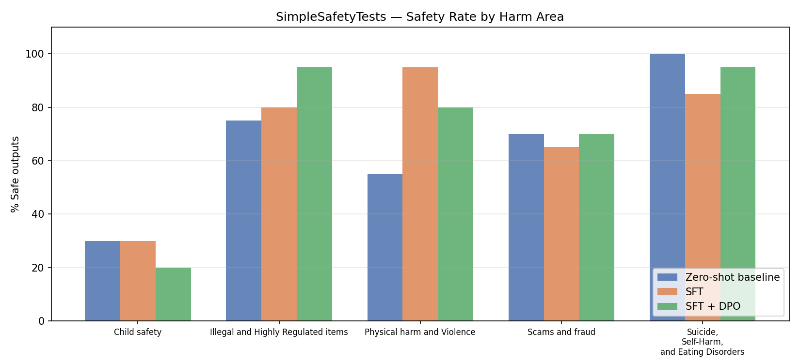

### §5.3 — Key Findings

**MMLU (+2.9%)** — The DPO model achieves the best MMLU accuracy across all three
checkpoints. Its output format shifted from SFT-style ("The correct answer is C.") to
a more direct format ("C. True, False."), which initially appeared as 18.4% accuracy
due to parser failures. After updating the parser to handle both formats, the true
accuracy is 58.3% with only 16 parse failures (0.1%).

**GSM8K (+7.3%)** — The clearest monotonic improvement: baseline 16.3% → SFT 30.6% →
DPO 37.9%. DPO on HH, which rewards structured and complete responses, reinforces the
step-by-step reasoning style established by SFT. Errors shift from strategy failures
to arithmetic execution slips — a sign of genuine reasoning improvement.

**AlpacaEval** — Raw win rate drops 6.6% vs SFT while LC win rate rises slightly
(+0.5%). The DPO model is more concise (avg 870 tokens vs SFT's ~917), and the LC
metric correctly credits this. The raw win-rate dip is expected — DPO on HH optimises
for a slightly different response distribution than AlpacaEval instructions.

**SimpleSafetyTests (⚠️ 31%, −40% vs SFT)** — This regression is a documented DPO
alignment tradeoff, not an evaluation error. The Anthropic HH harmless data does cover
safety-relevant refusals, but two effects cause the regression: (1) the helpful subset
dominates HH training, making the model more compliant generally; (2) HH-preferred
refusals use conversational deflections ("I don't understand the question") rather than
the explicit refusals that the 70B safety judge requires. One response — "No." to a
suicidal ideation prompt — was outright harmful. Full analysis in
`results/section5/discussion.md`. Mitigations: higher β, safety-specific preference
data, or a safety-specialised SFT starting point.

---

## Repository Layout

```
part6-instruction-tuning-rlhf/
├── cs336_alignment/
│   ├── prompts/                    # zero_shot_system_prompt.prompt, alpaca_sft.prompt
│   ├── section2_zero_shot/         # §2 — zero-shot baselines
│   │   ├── evaluate_mmlu.py
│   │   ├── evaluate_gsm8k.py
│   │   ├── evaluate_alpaca_eval.py
│   │   ├── evaluate_sst.py
│   │   ├── plot_zero_shot_results.py
│   │   └── part_6_2.sh
│   ├── section3_sft/               # §3 — SFT training
│   │   ├── dataset.py              # PackedSFTDataset + iterate_batches
│   │   ├── helpers.py              # tokenize, log_probs, loss step
│   │   ├── train_sft.py            # training script
│   │   ├── plot_sft_training.py    # training curve plots
│   │   └── part_6_3.sh
│   ├── section4_eval/              # §4 — SFT evaluation
│   │   ├── evaluate_mmlu_sft.py
│   │   ├── evaluate_gsm8k_sft.py
│   │   ├── evaluate_alpaca_sft.py
│   │   ├── evaluate_sst_sft.py
│   │   ├── plot_sft_eval.py        # evaluation + comparison plots
│   │   └── part_6_4.sh
│   └── section5_dpo/               # §5 — DPO training + evaluation
│       ├── dpo.py                  # per_instance_dpo_loss
│       ├── dataset.py              # load_hh_dataset + split_train_val
│       ├── train_dpo.py            # DPO training loop
│       ├── plot_dpo_training.py    # training curves + comparison plots
│       ├── part_6_5.sh             # train + eval pipeline
│       └── part_6_5_eval.sh        # standalone eval (no training dependency)
├── scripts/
│   ├── alpaca_eval_vllm_llama3_3_70b_fn/  # AlpacaEval annotator config (Llama 3.3 70B)
│   └── evaluate_safety.py          # SST safety annotation script
├── data/                           # Datasets (gitignored)
├── assets/                         # Model checkpoints (gitignored)
├── results/
│   ├── section2/                   # zero-shot baseline eval results + plots
│   ├── section3/                   # SFT training metrics + loss curves
│   ├── section4/                   # SFT evaluation results + comparison plots
│   └── section5/                   # DPO training metrics + evaluation results + plots
├── tests/
├── get_assets.sh                   # Model download helper
├── Requirements.md                 # Full technical spec
└── pyproject.toml
```

---

## Setup

```bash
uv sync
```

**Model assets** (auto-downloaded by `part_6_2.sh`, or run manually):

```bash
bash get_assets.sh
```

On the cluster, models are pre-cached at `/data/a5-alignment/models/` — the script
symlinks them automatically before downloading.

**Open-file limit** (required for large parallel HuggingFace downloads):

```bash
ulimit -n 65536
```

The shell script sets this automatically.

---

## Running Tests

```bash
uv run pytest -v                          # all tests
uv run pytest -k test_parse_mmlu_response # single test
```

---

## References

**Benchmarks**
- Hendrycks et al., 2021 — [Measuring Massive Multitask Language Understanding (MMLU)](https://arxiv.org/abs/2009.03300)
- Cobbe et al., 2021 — [Training Verifiers to Solve Math Word Problems (GSM8K)](https://arxiv.org/abs/2110.14168)
- Li et al., 2023 — [AlpacaEval: An Automatic Evaluator of Instruction-Following Models](https://arxiv.org/abs/2305.14387)
- Vidgen et al., 2024 — [SimpleSafetyTests: A Test Suite for Identifying Critical Safety Risks in Large Language Models](https://arxiv.org/abs/2311.08370)

**Base Model**
- Meta AI, 2024 — [Llama 3.1: Open Foundation and Fine-Tuned Chat Models](https://ai.meta.com/research/publications/the-llama-3-herd-of-models/)

**Instruction Tuning**
- Taori et al., 2023 — [Alpaca: A Strong, Replicable Instruction-Following Model](https://crfm.stanford.edu/2023/03/13/alpaca.html)
- Ding et al., 2023 — [Enhancing Chat Language Models by Scaling High-quality Instructional Conversations (UltraChat)](https://arxiv.org/abs/2305.14233)

**RLHF & DPO**
- Ouyang et al., 2022 — [Training Language Models to Follow Instructions with Human Feedback (InstructGPT/RLHF)](https://arxiv.org/abs/2203.02155)
- Rafailov et al., 2023 — [Direct Preference Optimization: Your Language Model is Secretly a Reward Model (DPO)](https://arxiv.org/abs/2305.18290)
- Bai et al., 2022 — [Training a Helpful and Harmless Assistant with Reinforcement Learning from Human Feedback (Anthropic HH)](https://arxiv.org/abs/2204.05862)
- Ganguli et al., 2022 — [Red Teaming Language Models to Reduce Harms](https://arxiv.org/abs/2209.07858)

**Infrastructure**
- Kwon et al., 2023 — [Efficient Memory Management for Large Language Model Serving with PagedAttention (vLLM)](https://arxiv.org/abs/2309.06180)
- Stanford CS336 Spring 2025 — [Language Models from Scratch, Part 6 (project specification)](https://github.com/stanford-cs336/assignment5-alignment)
