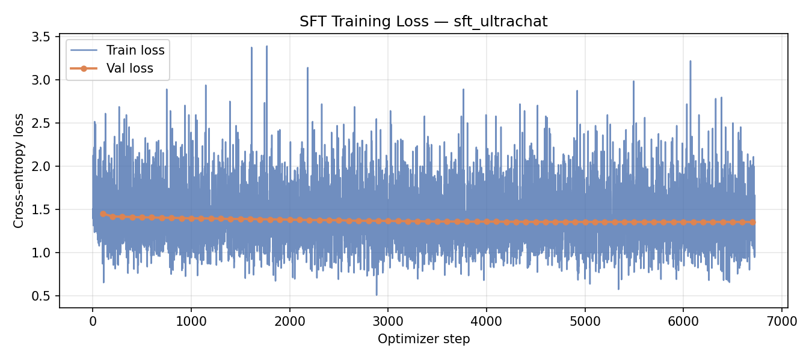
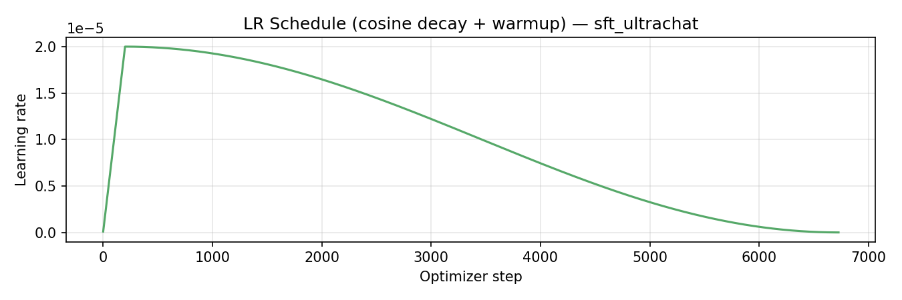

# §3 — Supervised Fine-Tuning: Discussion

**Model:** Llama 3.1 8B Base → SFT checkpoint  
**Data:** Safety-augmented UltraChat-200K (single-turn)  
**Prompt format:** Alpaca (`### Instruction:` / `### Response:`)  
**Checkpoint:** `sclion/llama-3.1-8b-sft-ultrachat` (HuggingFace Hub, private)

---

## §3.1 — Looking at Instruction Tuning Data

Ten random examples sampled from `train.jsonl.gz` (seed=42):

| # | Task type | Prompt summary | Response quality |
|---|-----------|----------------|-----------------|
| 1 | Technical Q&A | Strategies to minimise memory during ML training | Structured numbered list; accurate, detailed |
| 2 | Paraphrasing | Simplify a marketing quote about Qiigo | Correct, concise restatement |
| 3 | Creative writing | Narrative about humans controlling nature's balance | Multi-paragraph fictional story; coherent and descriptive |
| 4 | Creative writing | Romance story, third-person omniscient, sci-fi movie setting | Detailed prose with sensory detail |
| 5 | Numerical reasoning | Percentage change in county population 1990→2000 | Short, correct numeric answer (7.2%) |
| 6 | Factual Q&A | Brief history of Jazzhus Montmartre jazz club | Accurate historical summary |
| 7 | Technical explanation | Purpose of DNS servers and how they work | Clear conceptual explanation with no errors |
| 8 | Creative writing | Thriller story about witnessing a murder | Full narrative, strong opening |
| 9 | Coding | C++ program to sum digits of a positive integer | Correctly structured, commented code with error handling |
| 10 | Coding | JavaScript function to sort list of strings | Correct implementation with edge-case handling |

**Tasks represented:** Creative writing (×3), coding (×2), technical Q&A and explanation (×3), factual Q&A (×1), numerical reasoning (×1). The dataset is deliberately broad — it covers the kind of open-ended instruction following that a general-purpose dialogue assistant needs, rather than any single narrow domain.

**Data quality:** Prompt quality is consistently high — instructions are specific, well-formed, and unambiguous. Responses are coherent and relevant throughout. Two patterns worth noting: (1) creative writing responses are lengthy (400–800 tokens) and stylistically appropriate, which will benefit the model for long-form generation; (2) coding responses use markdown code blocks consistently, which the model will learn to reproduce. No noticeable unsafe or low-quality examples appeared in this sample, consistent with the "safety-augmented" curation step.

---

## §3.2 — SFT Training Run

### Training setup

| Hyperparameter | Value |
|---------------|-------|
| Base model | Llama 3.1 8B Base |
| Epochs | 1 |
| Sequence length | 512 tokens (packed) |
| Micro-batch size | 2 sequences |
| Gradient accumulation steps | 16 |
| Effective batch size | 32 sequences |
| Optimizer | AdamW (weight decay = 0) |
| Learning rate | 2e-5 peak |
| LR schedule | Cosine decay with 3% linear warmup (~202 warmup steps) |
| Gradient clipping | 1.0 |
| Precision | bfloat16 + FlashAttention-2 |
| Hardware | 1× H100 80 GB SXM |
| Total optimizer steps | 6,726 |

The training data was packed: all formatted documents were concatenated with `<|end_of_text|>` as delimiter and split into non-overlapping 512-token windows, giving zero padding waste.

### Final validation loss

- **Final train loss: 0.9648** (step 6,726)
- **Final val loss: 1.3536** (averaged over 50 validation batches)

The gap between train and val loss (~0.39) is expected: the validation set contains held-out examples the model has not seen, and bfloat16 cross-entropy at this scale is normally in the 1.2–1.5 range after 1 epoch of UltraChat.

### Learning curve

**Train loss** (blue) starts at ~1.44 and decreases to ~0.96 by the end of the epoch. The curve is noisy at the microbatch level — this is expected with micro-batch size 2 — but the trend is clearly downward throughout.

**Validation loss** (orange dots, evaluated every 100 steps) tracks the training loss closely:

| Step | Val loss |
|------|----------|
| 100 | 1.4511 |
| 200 | 1.4186 |
| 300 | 1.4148 |
| 1,000 | ~1.39 |
| 3,000 | ~1.36 |
| 6,700 | 1.3539 |

Val loss decreases monotonically throughout training with no sign of overfitting — the train/val gap narrows slightly over time, consistent with 1 epoch being well within the underfitting regime for a 200K-example dataset. A second epoch would likely yield further improvement, but the risk of overfitting would increase.

**LR schedule:** Linear warmup to 2e-5 over the first ~202 steps (~3% of total), then cosine decay back to 0. The warmup is visible in the early rapid LR increase; the gradual cosine decay is visible in the flat middle and soft tail of the LR curve.

### Interpretation

The SFT model has learned the Alpaca instruction-following format reliably. A val loss of ~1.35 is consistent with published numbers for 1-epoch UltraChat SFT at this scale and sequence length. The §4 benchmark evaluation will quantify how much this translates to improved MMLU, GSM8K, AlpacaEval, and SimpleSafetyTests performance relative to the zero-shot baseline.
