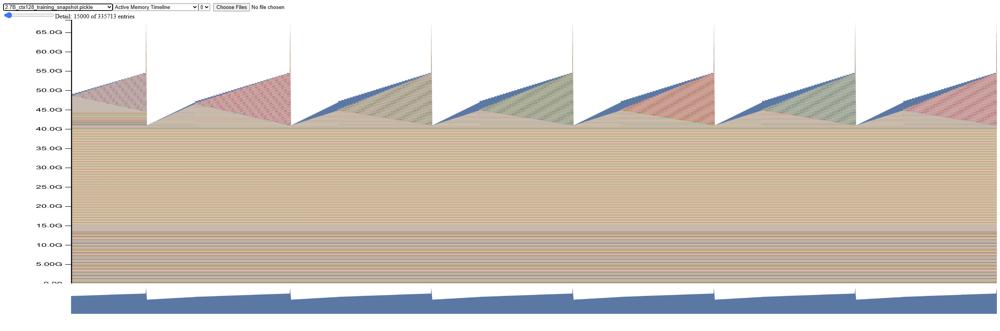
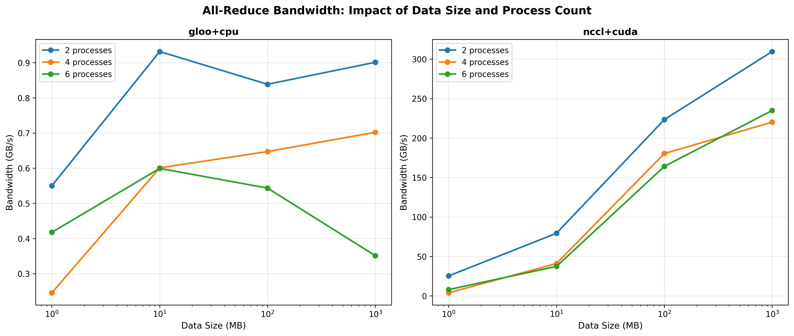
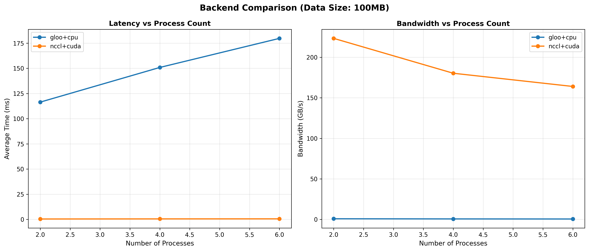
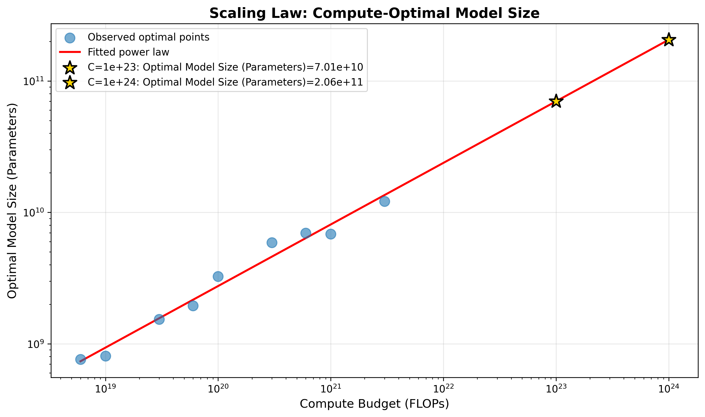
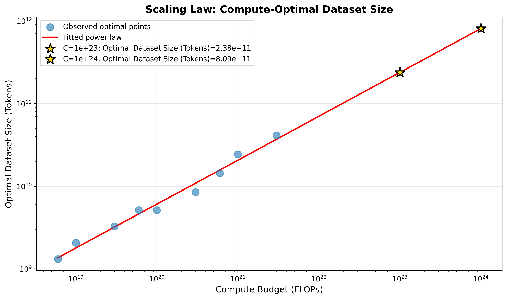

# Foundation Model Systems — Performance, Profiling & Scaling

End-to-end implementation of a language model training stack: BPE tokenizer, Transformer architecture, GPU kernel optimization, multi-GPU distributed training, empirical scaling law experiments, and a web-scale data filtering pipeline.

---

## Overview

| Part | Topic | Key Result |
|---|---|---|
| [Part 1](#part-1-tokenizer--transformer) | Tokenizer + Transformer | 4.68 val loss on OpenWebText in 1.5 hrs; ablations isolate impact of SwiGLU, RMSNorm, RoPE |
| [Part 2](#part-2-gpu-optimization--distributed-training) | GPU Optimization & Distributed Training | BF16 gives 1.87× speedup at 2.7B; NCCL 200× faster than CPU all-reduce at 100 MB |
| [Part 3](#part-3-scaling-laws) | Scaling Laws | N_opt = 1.16 × C^0.469 — predicts ~70B params at 10²³ FLOPs (matches Chinchilla) |
| [Part 4](#part-4-data-pipeline--training) | Data Pipeline & Training | Filtered 1.29M docs from 16.4M CC records; trained 85M-param model to 4.3 eval loss on Paloma |

---

## Tech Stack

**Languages & Frameworks:** Python, PyTorch, Triton

**GPU & Profiling:** CUDA, Nsight Systems (`nsys`), NVTX annotations, PyTorch `memory_snapshot`, `torch.cuda.synchronize()`

**Kernel Optimization:** FlashAttention-2, online softmax, tiling, activation recomputation, `torch.autograd.Function`, BF16 mixed precision, `torch.compile`

**Distributed Training:** DDP, gradient bucketing, comm/compute overlap, ZeRO-style optimizer sharding, NCCL, Gloo, all-reduce, all-gather

**Model Components:** BPE tokenizer, Transformer (RoPE, RMSNorm, SwiGLU, causal masking, weight tying), AdamW, cosine LR schedule, gradient clipping, nucleus sampling

**Scaling Laws:** IsoFLOPs, Chinchilla methodology, power-law fitting (`scipy.optimize`)

**Data Pipeline:** Common Crawl WARC/WET, Resiliparse, FastWARC, fastText (language ID, quality classifier, NSFW/toxic), Gopher filters, MinHash+LSH deduplication, PII masking

---

## Part 1: Tokenizer + Transformer

Built a complete language model training stack from scratch using only core PyTorch primitives (`nn.Parameter`, container classes, and the `Optimizer` base class — no `torch.nn` layers or `torch.optim` implementations).

### BPE Tokenizer
Byte-pair encoding over UTF-8 bytes with GPT-2 regex pre-tokenizer. Trained on TinyStories (10K vocab) and OpenWebText (32K vocab, 11.1 GB corpus).

### Transformer Architecture
Pre-norm design with RoPE positional embeddings, RMSNorm, SwiGLU feed-forward, causal masking, and weight tying between input embedding and output projection.

### Architecture Ablations

Isolated the impact of each architectural choice by training 5 variants of a 22.7M-parameter model on TinyStories (327.68M tokens each):

| Variant | Change from baseline | Best val loss |
|---------|----------------------|---------------|
| Baseline | Pre-norm, RoPE, SwiGLU | **1.390** |
| no_layer_norm | Remove all RMSNorm | 1.398 |
| post_norm | Post-norm instead of pre-norm | 1.390 |
| no_position_emb | No positional encoding (NoPE) | 1.390 |
| silu_ffn | SiLU FFN instead of SwiGLU | 1.410 |

**Findings:** SwiGLU measurably outperforms plain SiLU (+1.4% loss). Removing normalization causes unstable initialization (starting loss 17.7 vs 9.3) but recovers to near-baseline. Interestingly, post-norm and NoPE converge to the same loss as the baseline — normalization placement and explicit positional encoding have little effect at this scale.


### Batch Size Sweep

Swept batch sizes 1–256 at a constant 327.68M token budget:

| Batch size | Training time | Best val loss |
|------------|---------------|---------------|
| 1 | 7.22h | 1.382 |
| **8** | **3.06h** | **1.320** |
| 32 | 2.11h | 1.390 |
| 64 | 1.67h | 1.435 |
| 256 | 7.56h | 1.599 |

Batch=8 wins — at a fixed token budget, smaller batches mean more gradient updates.


### OpenWebText vs TinyStories

Same architecture and compute (327.68M tokens), different datasets:

| Dataset | Best val loss |
|---------|---------------|
| TinyStories | 1.32 |
| OpenWebText | 4.02 |

Higher OWT loss reflects the dataset's difficulty — general web text is far harder to model than narrow children's stories.


### Leaderboard — 1.5-Hour Budget

Optimized a 28.8M-parameter model on OpenWebText within a 1.5-hour compute budget using weight tying (36% parameter reduction), larger batch size, scaled LR, and bfloat16.

| Metric | Value |
|--------|-------|
| Best val loss | 4.678 (vs 5.0 baseline) |
| Perplexity | 107.6 |
| Tokens processed | 89.7M in 1.5 hrs |


---

## Part 2: GPU Optimization & Distributed Training

### Attention Benchmarking & FlashAttention

Standard attention memory grows quadratically with sequence length — `seq_len=16384` OOMs on RTX 4090. FlashAttention keeps Q/K/V tiles in SRAM and eliminates the O(seq_len²) HBM read/write, handling all sequence lengths with ~2–5× forward speedup.

### Memory Profiling — 2.7B Parameter Model

| Context length | Forward pass | Full training step |
|----------------|--------------|-------------------|
| 128 | 13,288 MB | 65,577 MB |
| 256 | 13,457 MB | 65,408 MB |
| 512 | 14,011 MB | 69,460 MB |

Training step memory (~5× forward) is dominated by AdamW optimizer states (2× parameters in FP32) and gradients.




### Mixed Precision (BF16)

BF16 speedup grows with model size — dominant at 2.7B where compute, not memory bandwidth, bottlenecks:

| Model | FP32 (ms) | BF16 (ms) | Speedup |
|-------|-----------|-----------|---------|
| small (128M) | 102 | 123 | 0.83× |
| large (969M) | 557 | 540 | 1.03× |
| 2.7B | 1,348 | 722 | **1.87×** |

### `torch.compile`

Largest gains on small models where kernel launch overhead dominates:

| Model | Context | Vanilla | Compiled | Speedup |
|-------|---------|---------|----------|---------|
| small (128M) | 128 | 107 ms | 21 ms | **5.0×** |
| 2.7B | 512 | 1,438 ms | 1,436 ms | 1.0× |

### Distributed Communication — NCCL vs Gloo

NCCL+CUDA is ~300× faster than gloo+CPU for all-reduce at 100 MB:

| Backend | Avg time (100 MB) | Peak bandwidth |
|---------|------------------|----------------|
| gloo+cpu | 149 ms | ~0.9 GB/s |
| nccl+cuda | 0.5 ms | **~310 GB/s** |





### Distributed Data Parallel (DDP)

Three variants benchmarked on a 2B-parameter (XL) model across 2 GPUs:

| Implementation | Avg step time | vs naive |
|----------------|--------------|---------|
| Naive DDP | 808.66 ms | 1.00× |
| Flat DDP (single bucket) | 790.91 ms | 1.02× |
| Overlap individual | 799.28 ms | 1.01× |

### ZeRO Optimizer Sharding

| Mode | Avg step time | Overhead |
|------|--------------|---------|
| Non-sharded | 783.53 ms | — |
| Sharded (ZeRO stage 1) | 836.05 ms | +6.7% |

~6.7% overhead for distributing optimizer states, enabling larger models in memory.

---

## Part 3: Scaling Laws

Reproduced the IsoFLOPs methodology from Hoffmann et al. (Chinchilla, 2022) to predict compute-optimal model and dataset sizes.

**Fitted scaling laws** (9 compute budgets, 6×10¹⁸ to 3×10²¹ FLOPs):

| Law | Formula |
|-----|---------|
| Compute-optimal model size | **N_opt = 1.16 × C^0.469** |
| Compute-optimal dataset size | **D_opt = 0.143 × C^0.531** |

Exponents (~0.47/~0.53) closely match Chinchilla, confirming roughly equal scaling of model size and data with compute.

**Extrapolated predictions:**

| Compute budget | Optimal model size | Optimal tokens |
|---|---|---|
| 10²³ FLOPs | ~70B parameters | ~238B tokens |
| 10²⁴ FLOPs | ~206B parameters | ~809B tokens |





---

## Part 4: Data Pipeline & Training

An end-to-end pipeline from raw Common Crawl web data to a trained language model evaluated on the Paloma benchmark.

### Filtering Pipeline

Applied in order — first rejection wins:

| Stage | Documents removed | % of total |
|-------|-------------------|------------|
| Too short (<100 chars) | 262,401 | 1.6% |
| Non-English (fastText, score < 0.65) | 10,603,105 | 64.8% |
| Gopher rules (word count, alpha ratio, ellipsis) | 481,112 | 2.9% |
| Low quality (fastText classifier, wiki-prob < 0.3) | 3,723,914 | 22.8% |
| NSFW (Dolma classifier, confidence ≥ 0.8) | 2,810 | 0.02% |
| **Kept** | **1,292,650** | **7.9%** |
| **Total records (600 WET files)** | **16,365,992** | — |

Processing time: 899s across 16 workers.

### Deduplication

- **Exact line deduplication** — removes repeated boilerplate lines across documents
- **MinHash + LSH** — near-duplicate removal using Jaccard similarity on 5-gram sets

### Model Training

Trained an 85M-parameter GPT-2 scale model on 2× A100 GPUs for 100,000 steps.

| Hyperparameter | Value |
|---|---|
| Parameters (non-embedding) | 84.95M |
| Context length | 512 |
| d_model | 768 |
| Layers | 12 |
| dtype | bfloat16 |
| Total tokens/step | 131,072 |

| Metric | Value |
|--------|-------|
| Train loss (final) | ~2.5 |
| Best eval loss (Paloma C4-100-domains) | ~4.3 (step ~60k) |
| Final eval loss | ~4.5 |


---

## Repository Structure

```
Foundation_model_performance_and_scaling/
├── part1-basics/          # BPE tokenizer, Transformer, AdamW, ablations
│   ├── cs336_basics/
│   └── pics/                    # Key result plots
├── part2-systems/         # FlashAttention, profiling, DDP, ZeRO sharding
│   ├── cs336_systems/
│   └── results/                 # Benchmark CSVs, memory snapshots, Nsight traces
├── part3-scaling/         # IsoFLOPs fitting, compute-optimal predictions
│   └── results/part1_isoflops/
└── part4-data/            # CC filtering pipeline, tokenization, model training
    ├── cs336_data/
    └── results/screenshots/
```

## Setup

Each part uses [`uv`](https://github.com/astral-sh/uv) for dependency management:

```bash
cd part1-basics   # or part2-systems, part3-scaling, part4-data
uv sync
uv run python <script>
uv run pytest
```

## References

- Hoffmann et al., 2022 — [Chinchilla: Training Compute-Optimal Large Language Models](https://arxiv.org/abs/2203.15556)
- Dao et al., 2022 — [FlashAttention: Fast and Memory-Efficient Exact Attention](https://arxiv.org/abs/2205.14135)
- Kaplan et al., 2020 — [Scaling Laws for Neural Language Models](https://arxiv.org/abs/2001.08361)
