# Foundation Models — From Architecture to Alignment

End-to-end implementation of a language model training stack: BPE tokenizer, Transformer architecture, GPU kernel optimization, multi-GPU distributed training, empirical scaling law experiments, and a web-scale data filtering pipeline.

---

## Overview

| Part | Topic | Key Result | Details |
|---|---|---|---|
| [Part 1](#part-1-tokenizer--transformer) | Tokenizer + Transformer | 4.68 val loss on OpenWebText in 1.5 hrs; ablations isolate impact of SwiGLU, RMSNorm, RoPE | [README](Foundation_model_performance_and_scaling/part1-basics/README.md) |
| [Part 2](#part-2-gpu-optimization--distributed-training) | GPU Optimization & Distributed Training | BF16 gives 1.87× speedup at 2.7B; NCCL 200× faster than CPU all-reduce at 100 MB | [README](Foundation_model_performance_and_scaling/part2-systems/README.md) |
| [Part 3](#part-3-scaling-laws) | Scaling Laws | N_opt = 1.16 × C^0.469 — predicts ~70B params at 10²³ FLOPs (matches Chinchilla) | [README](Foundation_model_performance_and_scaling/part3-scaling/README.md) |
| [Part 4](#part-4-data-pipeline--training) | Data Pipeline & Training | Filtered 1.29M docs from 16.4M CC records; trained 85M-param model to 4.3 eval loss on Paloma | [README](Foundation_model_performance_and_scaling/part4-data/README.md) |
| [Part 5](#part-5-alignment--reasoning-rl) | Alignment & Reasoning RL | Zero-shot 2.5% → SFT 65.0% → Expert Iteration 52.5% → GRPO 71.1% (question_only prompt, off-policy e4 bs128) | [README](Foundation_model_performance_and_scaling/part5-alignment/README.md) |

---

## Tech Stack

**Languages & Frameworks:** Python, PyTorch, Triton

**GPU & Profiling:** CUDA, Nsight Systems (`nsys`), NVTX annotations, PyTorch `memory_snapshot`, `torch.cuda.synchronize()`

**Kernel Optimization:** FlashAttention-2, online softmax, tiling, activation recomputation, `torch.autograd.Function`, BF16 mixed precision, `torch.compile`

**Distributed Training:** DDP, gradient bucketing, comm/compute overlap, ZeRO-style optimizer sharding, NCCL, Gloo, all-reduce, all-gather

**Model Components:** BPE tokenizer, Transformer (RoPE, RMSNorm, SwiGLU, causal masking, weight tying), AdamW, cosine LR schedule, gradient clipping, nucleus sampling

**Scaling Laws:** IsoFLOPs, Chinchilla methodology, power-law fitting (`scipy.optimize`)

**Data Pipeline:** Common Crawl WARC/WET, Resiliparse, FastWARC, fastText (language ID, quality classifier, NSFW/toxic), Gopher filters, MinHash+LSH deduplication, PII masking

---

## Part 1: Tokenizer + Transformer

Built a complete language model training stack from scratch using only core PyTorch primitives (`nn.Parameter`, container classes, and the `Optimizer` base class — no `torch.nn` layers or `torch.optim` implementations).

### BPE Tokenizer
Byte-pair encoding over UTF-8 bytes with GPT-2 regex pre-tokenizer. Trained on TinyStories (10K vocab) and OpenWebText (32K vocab, 11.1 GB corpus).

### Transformer Architecture
Pre-norm design with RoPE positional embeddings, RMSNorm, SwiGLU feed-forward, causal masking, and weight tying between input embedding and output projection.

### Architecture Ablations

Isolated the impact of each architectural choice by training 5 variants of a 22.7M-parameter model on TinyStories (327.68M tokens each):

| Variant | Change from baseline | Best val loss |
|---------|----------------------|---------------|
| Baseline | Pre-norm, RoPE, SwiGLU | **1.390** |
| no_layer_norm | Remove all RMSNorm | 1.398 |
| post_norm | Post-norm instead of pre-norm | 1.390 |
| no_position_emb | No positional encoding (NoPE) | 1.390 |
| silu_ffn | SiLU FFN instead of SwiGLU | 1.410 |

**Findings:** SwiGLU measurably outperforms plain SiLU (+1.4% loss). Removing normalization causes unstable initialization (starting loss 17.7 vs 9.3) but recovers to near-baseline. Interestingly, post-norm and NoPE converge to the same loss as the baseline — normalization placement and explicit positional encoding have little effect at this scale.


### Batch Size Sweep

Swept batch sizes 1–256 at a constant 327.68M token budget:

| Batch size | Training time | Best val loss |
|------------|---------------|---------------|
| 1 | 7.22h | 1.382 |
| **8** | **3.06h** | **1.320** |
| 32 | 2.11h | 1.390 |
| 64 | 1.67h | 1.435 |
| 256 | 7.56h | 1.599 |

Batch=8 wins — at a fixed token budget, smaller batches mean more gradient updates.


### OpenWebText vs TinyStories

Same architecture and compute (327.68M tokens), different datasets:

| Dataset | Best val loss |
|---------|---------------|
| TinyStories | 1.32 |
| OpenWebText | 4.02 |

Higher OWT loss reflects the dataset's difficulty — general web text is far harder to model than narrow children's stories.


### Leaderboard — 1.5-Hour Budget

Optimized a 28.8M-parameter model on OpenWebText within a 1.5-hour compute budget using weight tying (36% parameter reduction), larger batch size, scaled LR, and bfloat16.

| Metric | Value |
|--------|-------|
| Best val loss | 4.678 (vs 5.0 baseline) |
| Perplexity | 107.6 |
| Tokens processed | 89.7M in 1.5 hrs |


---

## Part 2: GPU Optimization & Distributed Training

### Attention Benchmarking & FlashAttention

Standard attention memory grows quadratically with sequence length — `seq_len=16384` OOMs on RTX 4090. FlashAttention keeps Q/K/V tiles in SRAM and eliminates the O(seq_len²) HBM read/write. Implemented in three variants (PyTorch reference, Triton kernel, optimized Triton). Forward speedup grows with sequence length — ~5× at seq=128, reaching ~10–13× at seq=16384–65536.

### Memory Profiling — 2.7B Parameter Model

| Context length | Forward pass | Full training step |
|----------------|--------------|-------------------|
| 128 | 13,288 MB | 65,577 MB |
| 256 | 13,457 MB | 65,408 MB |
| 512 | 14,011 MB | 69,460 MB |

Training step memory (~5× forward) is dominated by AdamW optimizer states (2× parameters in FP32) and gradients.


### Mixed Precision (BF16)

BF16 speedup grows with model size — dominant at 2.7B where compute, not memory bandwidth, bottlenecks:

| Model | FP32 (ms) | BF16 (ms) | Speedup |
|-------|-----------|-----------|---------|
| small (128M) | 102 | 123 | 0.83× |
| medium (423M) | 267 | 290 | 0.92× |
| large (969M) | 557 | 540 | 1.03× |
| xl (2B) | 1,053 | 883 | 1.19× |
| 2.7B | 1,348 | 722 | **1.87×** |

### `torch.compile`

Largest gains on small models where kernel launch overhead dominates:

| Model | Context | Vanilla | Compiled | Speedup |
|-------|---------|---------|----------|---------|
| small (128M) | 128 | 107 ms | 21 ms | **5.0×** |
| 2.7B | 512 | 1,438 ms | 1,436 ms | 1.0× |

### Distributed Communication — NCCL vs Gloo

NCCL+CUDA is ~300× faster than gloo+CPU for all-reduce at 100 MB:

| Backend | Avg time (100 MB) | Peak bandwidth |
|---------|------------------|----------------|
| gloo+cpu | 149 ms | ~0.9 GB/s |
| nccl+cuda | 0.5 ms | **~310 GB/s** |


### Distributed Data Parallel (DDP)

Four variants benchmarked on a 2B-parameter (XL) model across 2 GPUs:

| Implementation | Avg step time | vs naive |
|----------------|--------------|---------|
| Naive DDP | 808.66 ms | 1.00× |
| Flat DDP (single bucket) | 790.91 ms | 1.02× |
| Overlap individual | 799.28 ms | 1.01× |

Bucketed DDP — larger buckets reduce all-reduce call overhead:

| Bucket size | Avg step time |
|-------------|--------------|
| 1 MB (435 buckets) | 1,004 ms |
| 100 MB (98 buckets) | 993 ms |
| 1,000 MB (8 buckets) | **980 ms** |

The speedups are intentionally modest: at 2 GPUs with a 2B-parameter model, compute dominates and gradient communication is a small fraction of total step time — leaving little headroom for overlap to exploit. The value of these implementations is scalability: as world size grows (8, 64, 256 GPUs), the all-reduce communication grows proportionally while per-GPU compute stays fixed, and comm/compute overlap becomes the dominant source of efficiency gains.

### ZeRO Optimizer Sharding

| Mode | Avg step time | Overhead |
|------|--------------|---------|
| Non-sharded | 783.53 ms | — |
| Sharded (ZeRO stage 1) | 836.05 ms | +6.7% |

ZeRO stage 1 distributes optimizer states (momentum + variance) across GPUs, cutting per-GPU optimizer memory by 1/N. The 6.7% compute overhead is the cost of the extra all-gather needed to reconstruct parameters after the sharded optimizer step — a worthwhile trade when the optimizer states alone would exceed GPU memory for very large models.

---

## Part 3: Scaling Laws

Reproduced the IsoFLOPs methodology from Hoffmann et al. (Chinchilla, 2022) to predict compute-optimal model and dataset sizes.

**Fitted scaling laws** (9 compute budgets, 6×10¹⁸ to 3×10²¹ FLOPs):

| Law | Formula |
|-----|---------|
| Compute-optimal model size | **N_opt = 1.16 × C^0.469** |
| Compute-optimal dataset size | **D_opt = 0.143 × C^0.531** |

Exponents (~0.47/~0.53) closely match Chinchilla, confirming roughly equal scaling of model size and data with compute.

**Extrapolated predictions:**

| Compute budget | Optimal model size | Optimal tokens |
|---|---|---|
| 10²³ FLOPs | ~70B parameters | ~238B tokens |
| 10²⁴ FLOPs | ~206B parameters | ~809B tokens |


---

## Part 4: Data Pipeline & Training

An end-to-end pipeline from raw Common Crawl web data to a trained language model evaluated on the Paloma benchmark.

### Filtering Pipeline

Applied in order — first rejection wins:

| Stage | Documents removed | % of total |
|-------|-------------------|------------|
| Too short (<100 chars) | 262,401 | 1.6% |
| Non-English (fastText, score < 0.65) | 10,603,105 | 64.8% |
| Gopher rules (word count, alpha ratio, ellipsis) | 481,112 | 2.9% |
| Low quality (fastText classifier, wiki-prob < 0.3) | 3,723,914 | 22.8% |
| NSFW (Dolma classifier, confidence ≥ 0.8) | 2,810 | 0.02% |
| **Kept** | **1,292,650** | **7.9%** |
| **Total records (600 WET files)** | **16,365,992** | — |

Processing time: 899s across 16 workers.

### Deduplication

- **Exact line deduplication** — removes repeated boilerplate lines across documents
- **MinHash + LSH** — near-duplicate removal using Jaccard similarity on 5-gram sets

### Model Training

Trained an 85M-parameter GPT-2 scale model on 2× A100 GPUs for 100,000 steps.

| Hyperparameter | Value |
|---|---|
| Parameters (non-embedding) | 84.95M |
| Context length | 512 |
| d_model | 768 |
| Layers | 12 |
| dtype | bfloat16 |
| Total tokens/step | 131,072 |

| Metric | Value |
|--------|-------|
| Train loss (final) | ~2.5 |
| Best eval loss (Paloma C4-100-domains) | ~4.3 (step ~60k) |
| Final eval loss | ~4.5 |


---

## Part 5: Alignment & Reasoning RL

Post-training pipeline for teaching Qwen 2.5 Math 1.5B Base to reason step-by-step on competition math (MATH dataset). Uses string-match verified rewards throughout — no cross-entropy, direct correctness measurement.

### Accuracy Progression

| Method | Accuracy | Notes |
|--------|----------|-------|
| Zero-shot baseline | 2.5% | Base model uses `\boxed{}` format, not r1_zero; 16.6% format compliance |
| SFT (128 examples) | ~51% | 128 reasoning traces enough to unlock format compliance |
| SFT (filtered, 4542 examples) | 65.0% | Correct-answer filtering outperforms full dataset (53.5%) |
| Expert Iteration G=1 (5 steps) | 48.5% | Self-bootstrapped from base model; no teacher data |
| Expert Iteration G=4 (5 steps) | 52.5% | Still climbing at step 5; G=4 provides richer training signal |
| GRPO — on-policy baseline (r1_zero) | 50.6% | `reinforce_with_baseline`, lr=1e-5, 200 steps |
| GRPO — off-policy (r1_zero) | 54.6% | `grpo_clip`, epochs=4, bs=128, 200 steps |
| **GRPO — off-policy (question_only)** | **71.1%** | Same config; prompt aligned with pretraining distribution |

### Zero-Shot Baseline

Qwen 2.5 Math 1.5B defaults to `\boxed{}` format from math pretraining rather than the required `<think>...</think><answer>...</answer>` format. Only 16.6% of responses comply with r1_zero format; of those, 14.9% are correct — suggesting latent reasoning ability that training can unlock.

### Supervised Fine-Tuning

Fine-tuned on reasoning traces generated by `gpt-oss-120b`. Even 128 examples jumps from 2.5% to ~51% — SFT immediately teaches format compliance, which unlocks most of the gain. Data quality matters: filtering to correct-only responses (4542 examples) reaches 65.0% and holds it through training, while the full dataset (4836 examples, ~6% wrong answers) peaks at 60.0% and degrades to 53.5%.


### Expert Iteration

Bootstraps reasoning from the base model using the STaR loop: generate G rollouts per question with vLLM → keep those with reward > 0 → fine-tune → sync weights back → repeat. No teacher-generated data required.

Two GPUs run in parallel: policy training on cuda:0 (PyTorch), batch inference on cuda:1 (vLLM). Weights are synced between EI steps via CPU intermediate to avoid cross-GPU CUDA stream deadlocks.

The self-bootstrapping effect is clear: the fraction of training questions with at least one correct rollout grows from ~8.7% (step 1) to ~45–50% (step 5) as the model improves. G=4 final accuracy (52.5%) beats G=1 (47.5%) and is still rising at step 5 — larger rollout budget covers harder problems.


### GRPO (Group Relative Policy Optimization)

Full ablation study across six dimensions using Qwen 2.5 Math 1.5B (base model, not SFT checkpoint). Each experiment builds on the best setting from the previous.

| Experiment | Winner | Key finding |
|------------|--------|-------------|
| §8.1 — LR sweep | lr=1e-5 | lr=1e-4 collapses (grad norm 47.5, entropy → 0.06); lr=1e-5 is stable |
| §8.2 — Baselining | `reinforce_with_baseline` | No baseline: 20× lower grad norm, slower format convergence, lower accuracy |
| §8.3 — Length norm | `masked_mean` | `masked_normalize` entropy spikes to 0.681; `masked_mean` trains more stably |
| §8.4 — Std norm | `with_std` (standard GRPO) | Dr. GRPO (`no_std`) shrinks gradient signal; `with_std` +1 pt peak accuracy |
| §8.5 — Off-policy | epochs=4, bs=128, `grpo_clip` | 8 gradient updates per rollout: +9 pt over on-policy; PPO clip essential — without it grad norm reaches 11 trillion |
| §8.6 — Prompt | `question_only` | +16.5 pt over r1_zero; model pretrained on natural math format — aligned prompt gives stable training (grad norm max 0.186 vs 7M) |

**Off-policy vs on-policy:** reusing each rollout batch for 8 gradient updates (epochs=4 × 2 mini-batches) instead of 1 raises peak accuracy from 45.7% to 54.6% with the same generation cost. PPO-style clipping is what makes this viable — without it, importance weights grow unconstrained and grad norms reach 11 trillion.

**Prompt × pretraining alignment:** the single largest accuracy jump in the entire study comes from switching prompts. `question_only` starts at 60.7% accuracy (vs 36.0% for r1_zero) because Qwen 2.5 Math 1.5B was pretrained on natural math text, not on `<think>…</think><answer>…</answer>` structured output. With an aligned prompt, RL updates are tiny (grad norm max 0.186), clip fraction near 0, and entropy stays stable — the policy barely needs to move to improve. This illustrates a general principle: **RL fine-tuning performance is bounded by the distance between the base model's pretrained distribution and the target behaviour**.

#### §8.1 — Learning Rate Sweep


#### §8.2 — Effect of Baselining

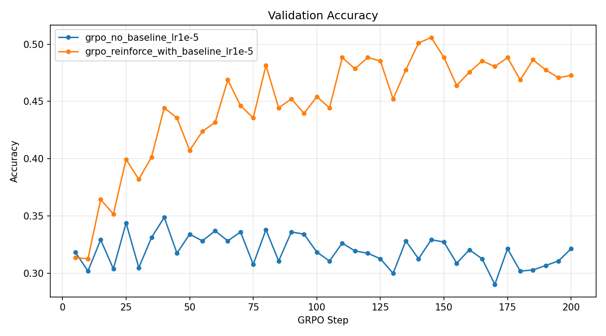

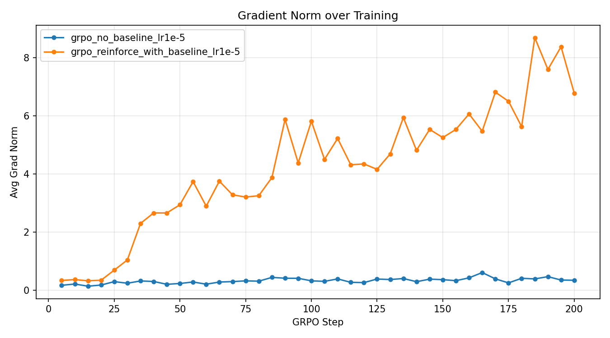

#### §8.3 — Length Normalization

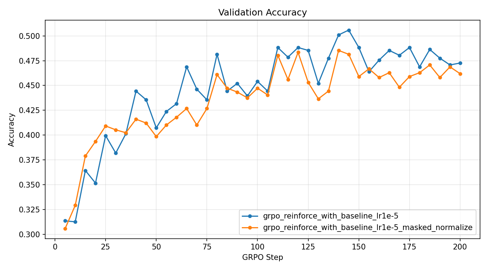

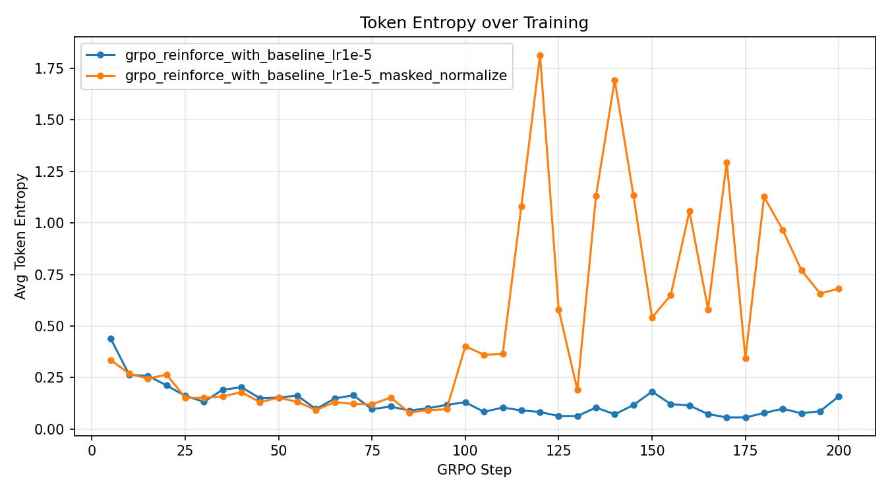

#### §8.4 — Group Standard Deviation Normalization

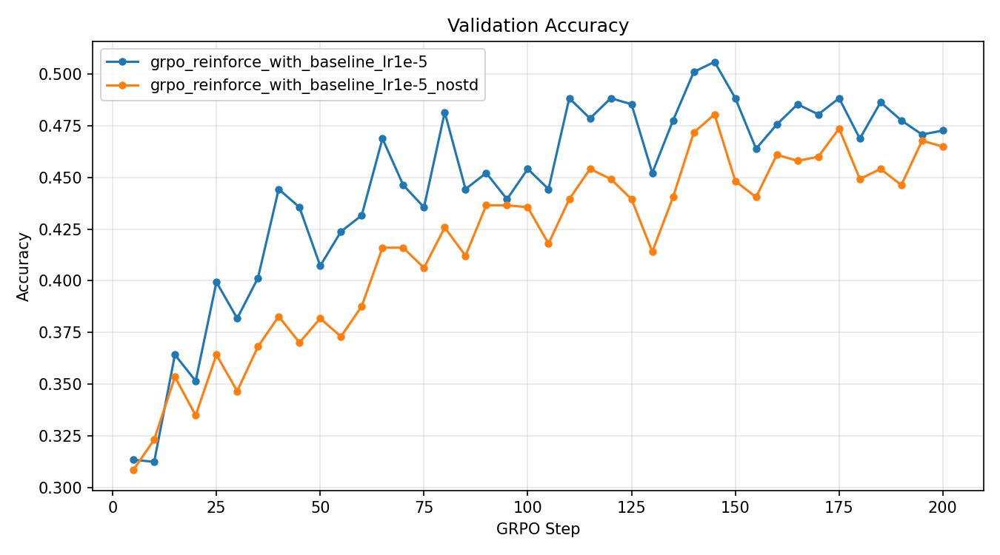

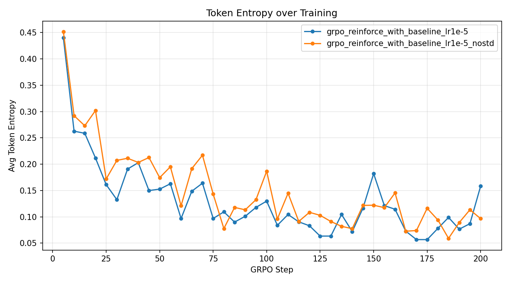

#### §8.5 — Off-Policy GRPO

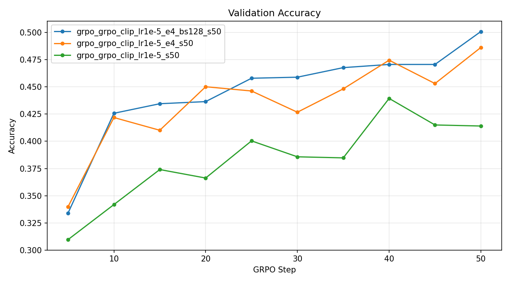

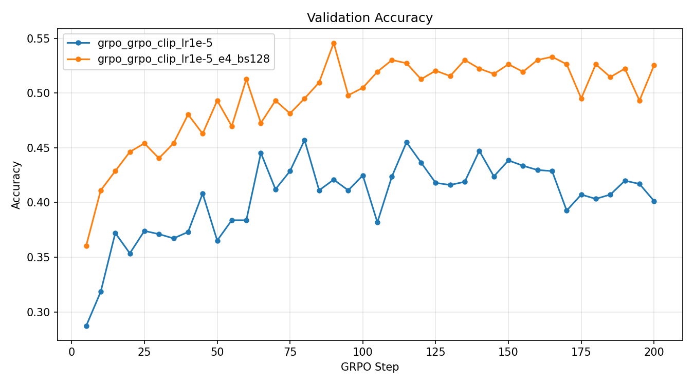

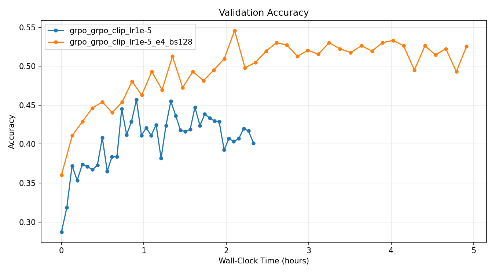

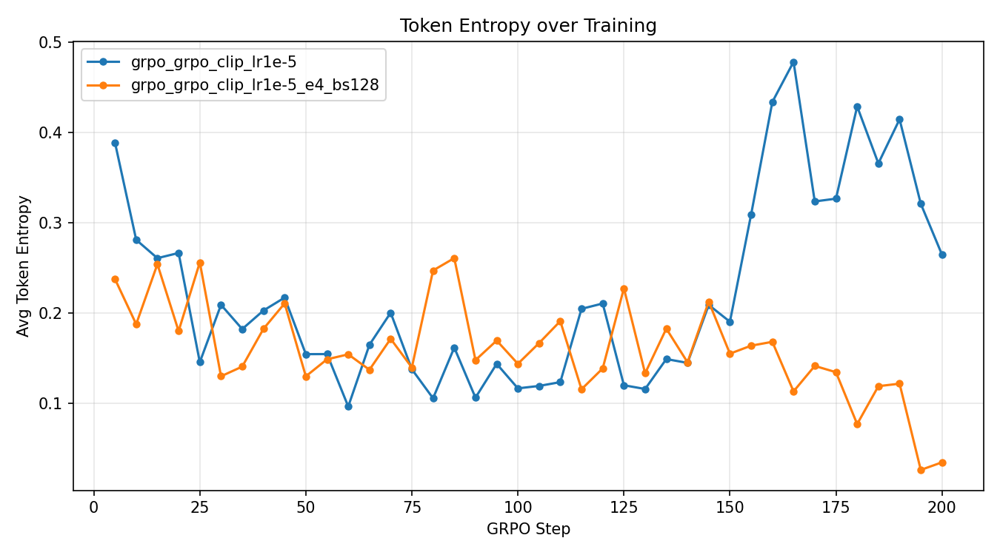

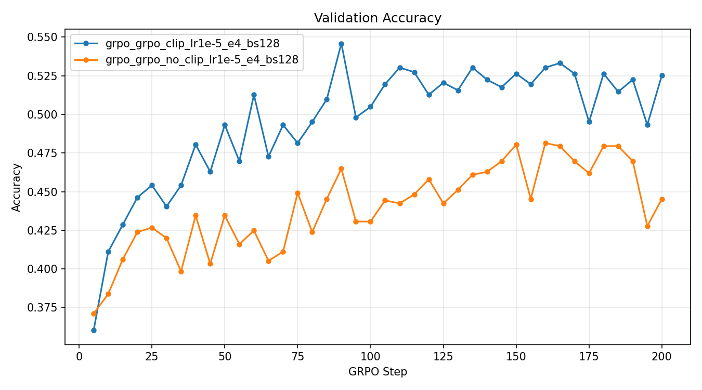

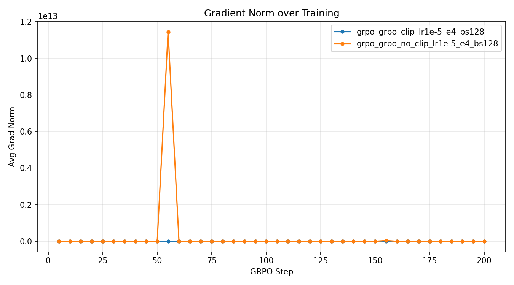

#### §8.6 — Prompt Ablation

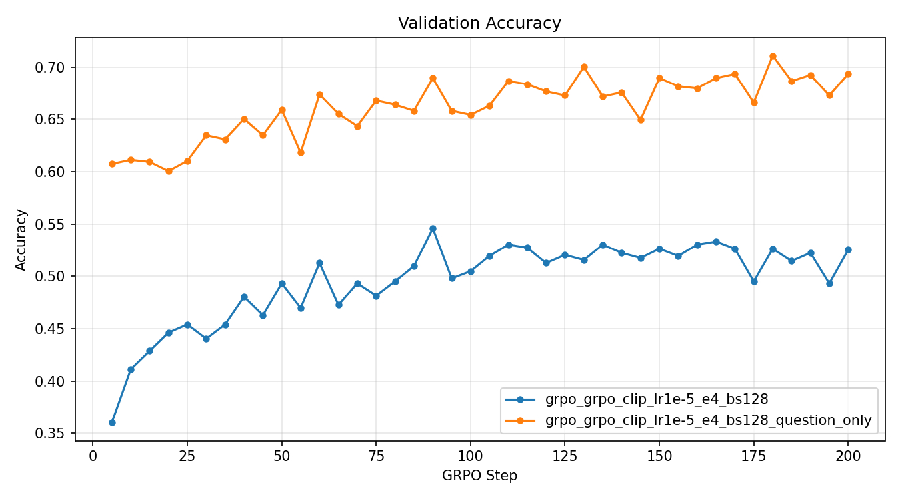

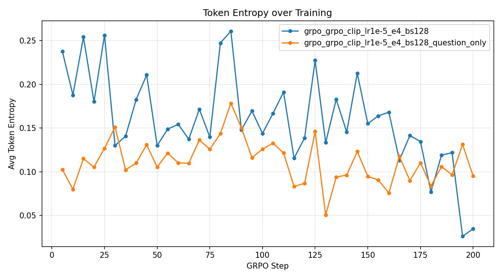

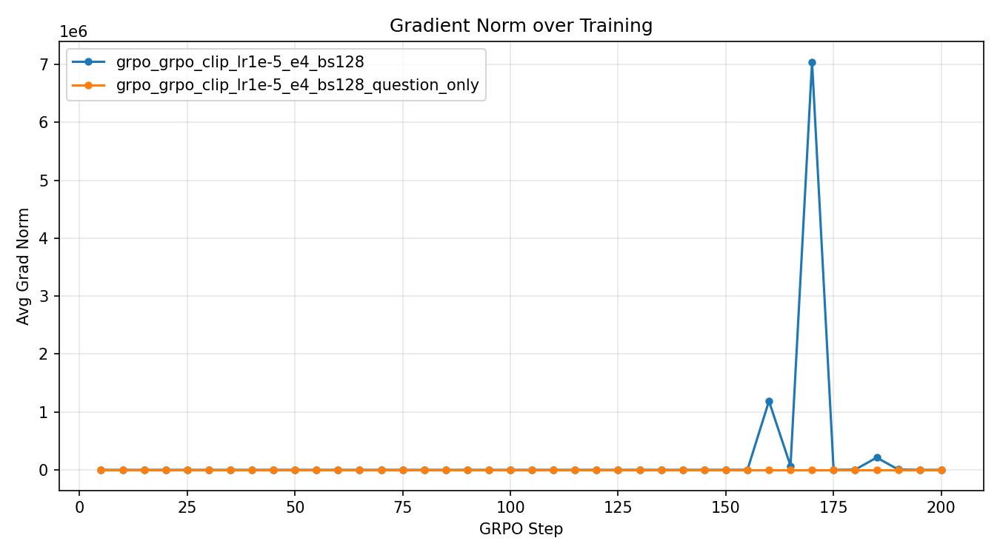

---

## Repository Structure

```
Foundation_model_performance_and_scaling/
├── part1-basics/          # BPE tokenizer, Transformer, AdamW, ablations
│   ├── cs336_basics/
│   └── pics/                    # Key result plots
├── part2-systems/         # FlashAttention, profiling, DDP, ZeRO sharding
│   ├── cs336_systems/
│   └── results/                 # Benchmark CSVs, memory snapshots, Nsight traces
├── part3-scaling/         # IsoFLOPs fitting, compute-optimal predictions
│   └── results/part1_isoflops/
├── part4-data/            # CC filtering pipeline, tokenization, model training
│   ├── cs336_data/
│   └── results/screenshots/
└── part5-alignment/       # Reasoning RL (SFT, Expert Iteration, GRPO) + RLHF/DPO — in progress
    └── cs336_alignment/
```

## Setup

Each part uses [`uv`](https://github.com/astral-sh/uv) for dependency management:

```bash
cd part1-basics   # or part2-systems, part3-scaling, part4-data, part5-alignment
uv sync
uv run python <script>
uv run pytest
```

## References

- Vaswani et al., 2017 — [Attention Is All You Need](https://arxiv.org/abs/1706.03762)
- Radford et al., 2019 — [Language Models Are Unsupervised Multitask Learners (GPT-2)](https://cdn.openai.com/better-language-models/language_models_are_unsupervised_multitask_learners.pdf)
- Sennrich et al., 2016 — [Neural Machine Translation of Rare Words with Subword Units (BPE)](https://arxiv.org/abs/1508.07909)
- Zhang & Sennrich, 2019 — [Root Mean Square Layer Normalization](https://arxiv.org/abs/1910.07467)
- Dao et al., 2022 — [FlashAttention: Fast and Memory-Efficient Exact Attention with IO-Awareness](https://arxiv.org/abs/2205.14135)
- Dao, 2023 — [FlashAttention-2: Faster Attention with Better Parallelism and Work Partitioning](https://arxiv.org/abs/2307.08691)
- Rajbhandari et al., 2020 — [ZeRO: Memory Optimizations Toward Training Trillion Parameter Models](https://arxiv.org/abs/1910.02054)
- Hoffmann et al., 2022 — [Chinchilla: Training Compute-Optimal Large Language Models](https://arxiv.org/abs/2203.15556)
- Kaplan et al., 2020 — [Scaling Laws for Neural Language Models](https://arxiv.org/abs/2001.08361)
- Rae et al., 2021 — [Scaling Language Models: Methods, Analysis & Insights from Training Gopher](https://arxiv.org/abs/2112.11446)
- Soldaini et al., 2024 — [Dolma: An Open Corpus of Three Trillion Tokens for Language Model Pretraining Research](https://arxiv.org/abs/2402.00159)
- Magnusson et al., 2023 — [Paloma: A Benchmark for Evaluating Language Model Fit](https://arxiv.org/abs/2312.10523)
- DeepSeek-AI et al., 2025 — [DeepSeek-R1: Incentivizing Reasoning Capability in LLMs via Reinforcement Learning](https://arxiv.org/abs/2501.12948)
- Zelikman et al., 2022 — [STaR: Bootstrapping Reasoning with Reasoning](https://arxiv.org/abs/2203.14465)
- Shao et al., 2024 — [DeepSeekMath: Pushing the Limits of Mathematical Reasoning (GRPO)](https://arxiv.org/abs/2402.03300)
- Ouyang et al., 2022 — [Training Language Models to Follow Instructions with Human Feedback (InstructGPT)](https://arxiv.org/abs/2203.02155)
- Rafailov et al., 2023 — [Direct Preference Optimization (DPO)](https://arxiv.org/abs/2305.18290)
- Hendrycks et al., 2021 — [Measuring Mathematical Problem Solving With the MATH Dataset](https://arxiv.org/abs/2103.03874)
- Cobbe et al., 2021 — [Training Verifiers to Solve Math Word Problems (GSM8K)](https://arxiv.org/abs/2110.14168)
- Yang et al., 2024 — [Qwen2.5-Math Technical Report: Toward Mathematical Expert Model via Self-Improvement](https://arxiv.org/abs/2409.12122)
- Nye et al., 2021 — [Show Your Work: Scratchpads for Intermediate Computation with Language Models](https://arxiv.org/abs/2112.00114)
- Wei et al., 2023 — [Chain-of-Thought Prompting Elicits Reasoning in Large Language Models](https://arxiv.org/abs/2201.11903)
- Anthony et al., 2017 — [Thinking Fast and Slow with Deep Learning and Tree Search](https://arxiv.org/abs/1705.08439)
- Gulcehre et al., 2023 — [Reinforced Self-Training (ReST) for Language Modeling](https://arxiv.org/abs/2308.08998)
- OpenAI et al., 2024 — [OpenAI o1 System Card](https://arxiv.org/abs/2412.16720)
- Kimi Team, 2025 — [Kimi k1.5: Scaling Reinforcement Learning with LLMs](https://arxiv.org/abs/2501.12599)
- Hugging Face, 2025 — [Open R1: A Fully Open Reproduction of DeepSeek-R1](https://github.com/huggingface/open-r1)
- Zeng et al., 2025 — [SimpleRL-Zoo: Investigating and Taming Zero Reinforcement Learning for Open Base Models](https://arxiv.org/abs/2503.18892)
- Pan et al., 2025 — [TinyZero](https://github.com/Jiayi-Pan/TinyZero)
- Lambert et al., 2025 — [Tulu 3: Pushing Frontiers in Open Language Model Post-Training](https://arxiv.org/abs/2411.15124)
- Sutton et al., 1999 — [Policy Gradient Methods for Reinforcement Learning with Function Approximation (REINFORCE)](https://proceedings.neurips.cc/paper_files/paper/1999/file/464d828b85b0bed98e80ade0a5c43b0f-Paper.pdf)
- Schulman et al., 2017 — [Proximal Policy Optimization Algorithms (PPO)](https://arxiv.org/abs/1707.06347)
- Degris et al., 2013 — [Off-Policy Actor-Critic](https://arxiv.org/abs/1205.4839)
- Liu et al., 2025 — [Understanding R1-Zero-Like Training: A Critical Perspective (Dr. GRPO)](https://arxiv.org/abs/2503.20783)
- Yu et al., 2025 — [DAPO: An Open-Source LLM Reinforcement Learning System at Scale](https://arxiv.org/abs/2503.14476)
- NTT123, 2025 — [GRPO-Zero](https://github.com/policy-gradient/GRPO-Zero)
- Kwon et al., 2023 — [Efficient Memory Management for Large Language Model Serving with PagedAttention (vLLM)](https://arxiv.org/abs/2309.06180)
- Achiam, 2018 — [Spinning Up in Deep Reinforcement Learning](https://spinningup.openai.com)
- Lambert, 2024 — [Reinforcement Learning from Human Feedback](https://rlhfbook.com)
- Stanford CS336 Spring 2025 — [Language Models from Scratch](https://github.com/stanford-cs336)
